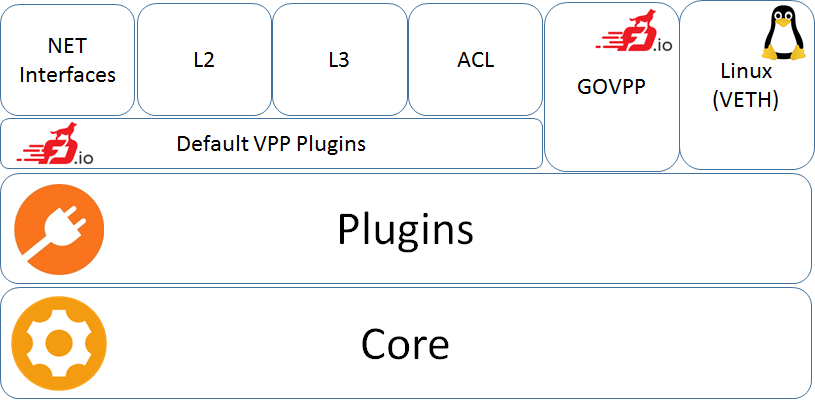

# VPP Agent

[](https://travis-ci.org/ligato/vpp-agent)
[](https://coveralls.io/github/ligato/vpp-agent?branch=master)
[](https://goreportcard.com/report/github.com/ligato/vpp-agent)
[](https://github.com/ligato/vpp-agent/blob/master/LICENSE)

Please note that the content of this repository is currently a **WORK IN PROGRESS**.

The VPP Agent is a management tool for VPP ([FD.io Vector Packet Processing](https://fd.io/)) 
built on [cn-infra](https://github.com/ligato/cn-infra).

VPP Agent provides plugins that process high level (north-bound) configuration which 
is carefully translated to low level VPP Binary API calls. North-bound configuration
is modelled by proto files that can be found in the [default plugins](defaultplugins).



The agent consists of the following components:
* [Default VPP Plugins](defaultplugins) - provide abstraction on top of the VPP binary APIs for:
  * [NET Interfaces](defaultplugins/ifplugin) - network interfaces configuration (PCI Ethernet, MEMIF, AF_Packet, VXLAN, Loopback...)
  * [L2](defaultplugins/l2plugin) - Bridge Domains, FIBs...
  * [L3](defaultplugins/l3plugin) - IP Routes, VRFs...
  * [ACL](defaultplugins/aclplugin) - VPP access lists (VPP ACL plugin)
* [GOVPPmux](govppmux) - allows other plugins to access VPP independently on each other by means of connection multiplexing
* [Linux](linuxplugin) (VETH) - allows optional configuration of Linux virtual ethernet interfaces
* [Core](https://github.com/ligato/cn-infra/tree/master/core) - lifecycle management of plugins (loading, initialization, unloading) from [cn-infra](https://github.com/ligato/cn-infra)

## Quickstart
For quick start with the VPP Agent, you can use pre-build Docker images with the Agent and VPP
on [Dockerhub](https://hub.docker.com/r/ligato/vpp-agent/).

1. Run VPP + VPP Agent in a Docker image:
```
docker pull ligato/vpp-agent
docker run -it --name vpp --rm ligato/vpp-agent
```

2. Configure the VPP agent using agentctl:
```
docker exec -it vpp agentctl -h
```

3. Check the configuration (using agentctl or directly using VPP console):
```
docker exec -it vpp agentctl show
docker exec -it vpp vppctl
```

## Next Steps
Read the README for the [Development Docker Image](docker/dev_vpp_agent/README.md) for more details.

### Deployment:
[](docs/Deployment.md)

### Extensibility:


### Design & architecture:
[](docs/Design.md)

## Contribution:
If you are interested in contributing, please see the [contribution guidelines](CONTRIBUTING.md).

The tool used for managing third-party dependencies is [Glide](https://github.com/Masterminds/glide). After adding or updating
a dependency in `glide.yaml` run `make install-dep` to download specified dependencies into the vendor folder. 
