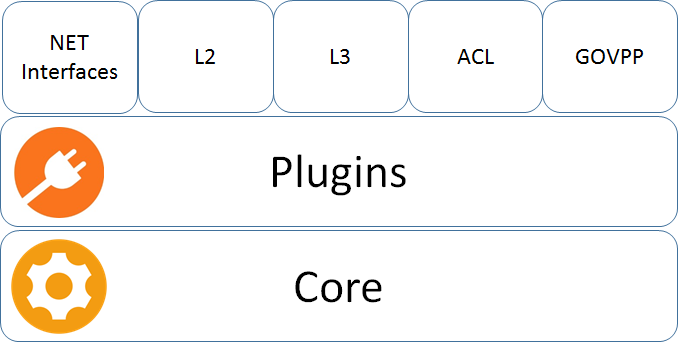

# VPP Agent

Please note that the content of the repository is currently WORK IN PROGRESS.

The VPP Agent is a management tool for VPP ([Vector Packet Processing](https://fd.io/)) built on [cn-infra](github.com/ligato/cn-infra).

 
* Default VPP Plugins - provides abstraction on top of VPP binary API for:
  * NET Interface - Network interfaces configuration (Gigi ETH, MEMIF, AF_Packet, VXLAN, Loopback...)
  * L2 - Bridge Domains, FIBs...
  * L3 - IP Routes, VRFs...
  * ACL - configures VPP ACL Plugin
* GOVPP - allows other plugins to access VPP independently on each other by means of connection multiplexing
* Linux (VETH) - configures Linux Virtual Ethernets
* Core - lifecycle management of plugins (loading, initialization, unloading) see [cn-infra](https://github.com/ligato/cn-infra)

# Quickstart(TBD)
1. Run VPP agent in Docker image
2. Configure the VPP agent using agentctl
3. Check the configurtion (using agentctl or directly using VPP console)

# Next Steps(TBD)
Deployment:

Extensibility:
TBD

Design & architecture:

Contribution:
If you are interested in contributing, please see the [contribution guidelines](CONTRIBUTING.md).

The tool used for managing third-party dependencies is [Glide](https://github.com/Masterminds/glide). After adding or updating
a dependency in `glide.yaml` run `make install-dep` to download specified dependencies into the vendor folder. 
