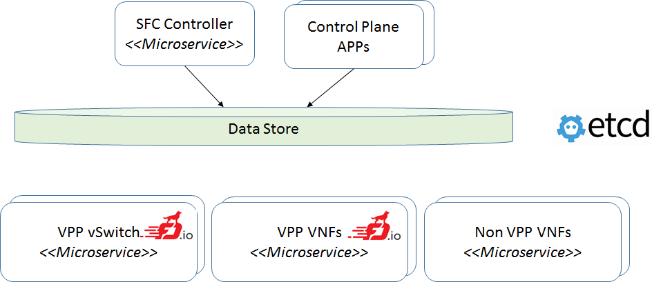
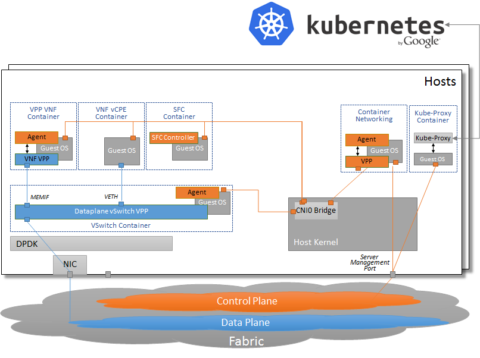

# VPP agent

Please note that the content of the repository is currently work in progress.

The vpp agent is a management tool for vpp built on [cn-infra](github.com/ligato/cn-infra).

The tool used for managing third-party dependencies is [Glide](https://github.com/Masterminds/glide). After adding or updating
a dependency in `glide.yaml` run `make install-dep` to download specified dependencies into the vendor folder. 

If you are interested in contributing, please see the [contribution guidelines](CONTRIBUTING.md).

# Architecture

VPP Agent Plugins on top of cn-infra:

10.000 feet architecture:

* SFC Controller - renders desired network stitching configuration for multiple agents to the Data Store
* Control Plane APPs - renders specific network configuration for multiple agents to the Data Store
* Data Store - ETCD, Redis, Cassandra etc. to:
  * store the configuration
  * operational state (network counters & statistics, errors...)
* VPP vSwitch - Privileged container that cross connects multiple VNFs
* VPP VNF - Benefits of putting VPP to a container
 * supports failover
 * simplifies: upgrade, start/top, potentially also scaling
 * microservices: small & reusable apps
* Non VPP VNF - non VPP containers can interact together with VPP containers (see below MEMIFs, VETH)
* Messaging - AD-HOC events (e.g. link UP/Down)
 
K8s integration:

Contiv deployment:
TBD - in memory calls (not remote calls)