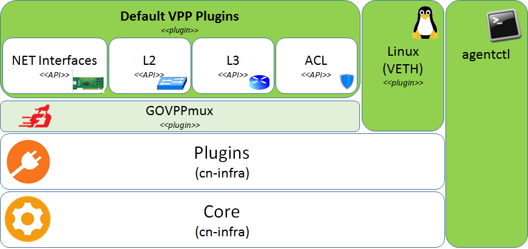

# VPP Agent


[](https://travis-ci.org/ligato/vpp-agent)
[](https://coveralls.io/github/ligato/vpp-agent?branch=master)
[](https://goreportcard.com/report/github.com/ligato/vpp-agent)
[](https://godoc.org/github.com/ligato/vpp-agent)
[](https://github.com/ligato/vpp-agent/blob/master/LICENSE)

###### Please note that the content of this repository is currently **WORK IN PROGRESS**!

The VPP Agent is a Go implementation of a control/management plane for [VPP][1] based
cloud-native [Virtual Network Functions][2] (VNFs). The VPP Agent is built on top of 
[CN Infra][16], a framework for developing cloud-native VNFs (CNFs).

The VPP Agent can be used as-is as a management/control agent for VNFs  based on off-the-shelf
VPP (e.g. a VPP-based vswitch), or as a framework for developing management agents for VPP-based
CNFs. An example of a custom VPP-based CNF is the [Contiv-VPP][20] vswitch.

### Releases

|Release|Release Date|Info|
|---|:---:|---|
|[](https://github.com/ligato/vpp-agent/releases/latest)||latest release|
|[](https://github.com/ligato/vpp-agent/releases)||last release/pre-release|

Have a look at the [release notes](CHANGELOG.md) for a complete list of changes.

### Branches

|Branch|Last Commit|Info|
|---|:---:|---|
|[](https://github.com/ligato/vpp-agent/tree/master)|| has **moved to v2**, introducing several [breaking changes](https://github.com/ligato/vpp-agent/blob/master/CHANGELOG.md#v200) :warning:|
|[](https://github.com/ligato/vpp-agent/tree/dev)||will be used for all the future **development**|
|[](https://github.com/ligato/vpp-agent/tree/pantheon-dev)||has been **deprecated** (v1) and will be removed in the following weeks|

### Images

|Image|Image Size/Layers|Info|
|---|:---:|---|
|[](https://cloud.docker.com/u/ligato/repository/docker/ligato/vpp-agent)| |minimal image for production|
|[](https://cloud.docker.com/u/ligato/repository/docker/ligato/dev-vpp-agent)| |image prepared for developers|

The image tag `latest` is built from **master branch** and `dev` tag is built from **dev branch**.

## Quickstart

For a quick start with the VPP Agent, you can use the pre-built Docker images on DockerHub
that contain the VPP Agent and VPP: [ligato/vpp-agent][14] (or for ARM64: [ligato/vpp-agent-arm64][17]).

0. Start ETCD (for image versions lower than 2.0, the Kafka is required as well) on your host (e.g. in Docker as described [here][15]).
   Note: **for ARM64 see the information for [kafka][18] and for [etcd][19]**.

1. Run VPP + VPP Agent in a Docker container:
```
docker pull ligato/vpp-agent
docker run -it --rm --name vpp --privileged ligato/vpp-agent
```

2. Manage VPP agent using agentctl:
```
docker exec -it vpp agentctl -h
```

3. Check the configuration (using agentctl or directly using VPP console):
```
docker exec -it vpp agentctl -e 172.17.0.1:2379 show
docker exec -it vpp vppctl -s localhost:5002
```

**Next Steps**

See [README](docker/dev/README.md) of development docker image for more details.

## Documentation

Detailed documentation for the VPP Agent can be found at [ligato.io/vpp-agent](https://ligato.io/vpp-agent/).

## Architecture

The VPP Agent is basically a set of VPP-specific plugins that use the 
CN-Infra framework to interact with other services/microservices in the
cloud (e.g. a KV data store, messaging, log warehouse, etc.). The VPP Agent
exposes VPP functionality to client apps via a higher-level model-driven 
API. Clients that consume this API may be either external (connecting to 
the VPP Agent via REST, gRPC API, Etcd or message bus transport), or local
Apps and/or Extension plugins running on the same CN-Infra framework in the 
same Linux process. 

The VNF Agent architecture is shown in the following figure: 



Each (northbound) VPP API - L2, L3, ACL, ... - is implemented by a specific
VNF Agent plugin, which translates northbound API calls/operations into 
(southbound) low level VPP Binary API calls. Northbound APIs are defined 
using [protobufs][3], which allow for the same functionality to be accessible
over multiple transport protocols (HTTP, gRPC, Etcd, ...). Plugins use the 
[GoVPP library][4] to interact with the VPP.

The following figure shows the VPP Agent in context of a cloud-native VNF, 
where the VNF's data plane is implemented using VPP/DPDK and 
its management/control planes are implemented using the VNF agent:


### Plugins
 
The set of plugins in the VPP Agent is as follows:
* [VPP plugins](plugins/vpp) - core plugins providing northbound APIs to _default_ VPP functionality: 
  - [Interfaces](plugins/vpp/ifplugin) - VPP network interfaces (e.g. DPDK, MEMIF, AF_Packet, VXLAN, Loopback..)
  - [L2](plugins/vpp/l2plugin) - Bridge Domains, L2 cross-connects..
  - [L3](plugins/vpp/l3plugin) - IP Routes, ARPs, ProxyARPs, VRFs..
  - [ACL](plugins/vpp/aclplugin) - VPP Access Lists (VPP ACL plugin)
* [Linux plugins](plugins/linux) (VETH) - allows optional configuration of Linux virtual ethernet 
  interfaces
  - [Interfaces](plugins/linux/ifplugin) - Linux network interfaces (e.g. VETH, TAP..)
  - [L3](plugins/linux/l3plugin) - IP Routes, ARPs
  - [NS](plugins/linux/nsplugin) - Linux network namespaces
* [GoVPPmux](plugins/govppmux) - plugin wrapper around GoVPP. Multiplexes plugins' access to
  VPP on a single connection.
* [RESTAPI](plugins/restapi) - provides API to retrieve actual state
* [KVScheduler](plugins/kvscheduler) - synchronizes the *desired state* described by northbound
  components with the *actual state* of the southbound. 

### Tools

The VPP agent repository also contains tools for building and troubleshooting 
of VNFs based on the VPP Agent:

* [agentctl](cmd/agentctl) - a CLI tool that shows the state of a set of 
   VPP agents can configure the agents
* [vpp-agent-ctl](cmd/vpp-agent-ctl) - a utility for testing VNF Agent 
  configuration. It contains a set of pre-defined configurations that can 
  be sent to the VPP Agent either interactively or in a script. 
* [docker](docker) - container-based development environment for the VPP
  agent and for app/extension plugins.

## Contributing

If you are interested in contributing, please see the [contribution guidelines](CONTRIBUTING.md).

[1]: https://fd.io/technology/#vpp
[2]: https://github.com/ligato/cn-infra/blob/master/docs/readmes/cn_virtual_function.md
[3]: https://developers.google.com/protocol-buffers/
[4]: https://wiki.fd.io/view/GoVPP
[14]: https://hub.docker.com/r/ligato/vpp-agent
[15]: docker/dev/README.md#running-etcd-server-on-local-host
[16]: https://github.com/ligato/cn-infra
[17]: https://hub.docker.com/r/ligato/vpp-agent-arm64
[18]: docs/arm64/kafka.md
[19]: docs/arm64/etcd.md
[20]: https://github.com/contiv/vpp
