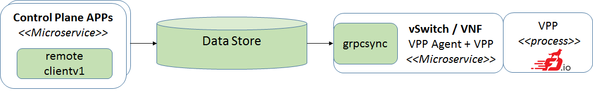
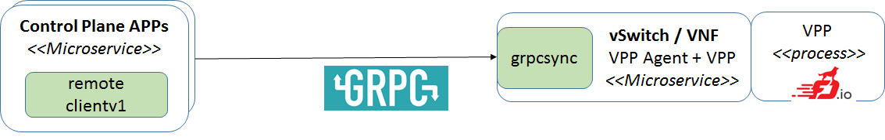

# Deployment

VPP Agent can run everywhere where VPP is installed. It can run either in a VM or in a container.
 
Benefits of putting VPP + VPP Agent into a container:
 * it simplifies: upgrade, start/stop, potentially also scaling
 * introducing microservices takes advantage of small & reusable apps
 * supports container healing 
 
## K8s integration
Following diagram depicts VPP deployed in:
- Data Plane vSwitch
- Control Plane vSwitch (TBD [Contiv](http://contiv.github.io/) integration)
- VPP VNF Container
- Non-VPP Container

K8s:
- starts/stops the containers on multiple hosts
- checks containers health (using probes - HTTP calls)

## NB (Nort-bound) configuration vs. deployment
VPP + Agent can be deployed in different environments. Several deployment alternatives are 
briefly described in the following sub-chapters. 
Independent on the deployment the VPP Agent can be configured
using the same Client v1 interface. There are three different implementations of the interface:
 - local client
 - remote client using Data Broker
 - remote client using GRPC

### Key Value Data Store for NB
The Control Plane using remote client writes configuration to the Data Store (tested with ETCD, Redis).
VPP Agent watches particular key prefixes in Data Store using dbsync package.

TBD links to the code

### GRPC 
The Control Plane using remote client sends configuration to the Data Store (tested with ETCD, Redis).
VPP Agent watches particular key prefixes in Data Store using grpcsync package.

TBD links to the code

### Embedded deployment
VPP Agent can be embedded in a different project. For integration with Contiv we use embedded deployment.
In this case VPP Agent gets the configuration from Local client v1 through in memory calls (Go API).

TBD links to the code