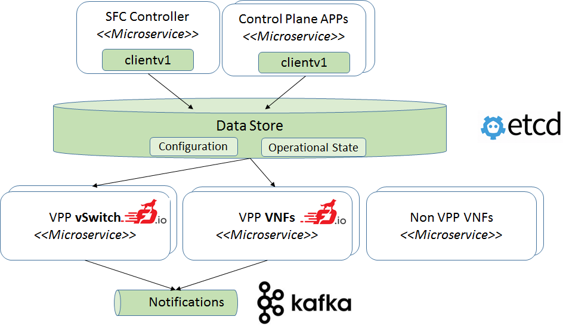

# Architecture

Brief description:
* SFC Controller - renders desired network stitching configuration for multiple agents to the Data Store
* Control Plane APPs - renders specific VPP configuration for multiple agents to the Data Store
* Client v1 - Control plane can use the Client v1 (VPP Agent Client v1) for submitting configuration for VPP Agents.
              The Client v1 is based on generated GO structures from protobuf messages & set of helper methods
              that generate keys and store the data to key the value Data Store.
* Data Store (ETCD, Redis, etc.) to:
  * store the VPP configuration
  * operational state (network counters & statistics, errors...)
* VPP vSwitch - privileged container that cross connects multiple VNFs
* VPP VNF - container that runs VPP that acts as Virtual Network Function 
* Non VPP VNF - non VPP containers can interact together with VPP containers (see below MEMIFs, VETH)
* Messaging - AD-HOC events (e.g. link UP/Down)

# Requirements
VPP Agent was designed with following principal requirements:
* Modular design with API contract
* Cloud native
* Fault tolerant
* Rapid deployment
* High performance & minimal footprint

## Modular design with API contract
The code is organized into multiple plugins. Each plugin exposes specific API. This approach allows 
to extend the functionality by introducing new plugins and enables integration of plugins by using the API.

## Cloud native
Assumption: data plane & control plane can be divided to multiple microservices.
Each microservice is independent. Therefore, it may occur that the configuration is incomplete: 
an object can refer to a non-existing object in configuration. 
Incomplete: one object refers the non existing object in configuration.
VPP agent can handle this - it skips incomplete part of configuration.
Later when the configuration is updated it tries again to configure what was skipped.

VPP Agent is usually deployed in a container together with VPP.
There can be many of these containers. Containers can be used in many different infrastructures 
(on-premise, hybrid, or public cloud). The VPP + VPP Agent containers have been tested with 
[Kubernetes](https://kubernetes.io/).

Control Plane microservices do not really depended on current lifecycle phase of the VPP Agents.
Control Plane can render the data to the Data Store even if VPP Agents are not started.
This is possible because:
- Control Plane does not access the VPP Agents directly but it rather accesses the Data Store
- Data structures are using logical names of objects inside the configuration (not internal identifiers of the VPP).
  See the [protobuf](https://developers.google.com/protocol-buffers/) definitions in model sub folders of VPP Agent. 

## Fault tolerant
Each microservice has it's own lifecycle therefore the agent is designed in the way that 
it recovers from situations that different microservice (db, message bus...) is temporary unavailable.

The same principle can be applied also for VPP Agent Process & VPP Process inside one container.
VPP Agent checks the VPP actual configuration and does data synchronization by polling latest
configuration from the Data Store.

VPP Agent also reports status of the VPP in probes & Status Check Plugin.  

In general VPP Agents:
 * propagate errors to upper layers & report to the Status Check Plugin
 * fault recovery is is performed with two different strategies:
   * easily recoverable errors: retry data synchronization (Data Store configuration -> VPP Binary API calls)
   * otherwise: report error to control plane which can failover or recreate the microservice

## Rapid deployment

Containers allow to reduce deployment time to seconds. This is due to the fact that containers are created at process level 
and there is no need to boot OS. More over K8s helps with (un)deploying different version of multiple instances 
of microservices.

## High performance & minimal footprint
Performance optimization is currently work in progress. Several bottlenecks that can be optimized have been identified:
- GOVPP
- minimize context switching
- replace blocking calls to non-blocking calls