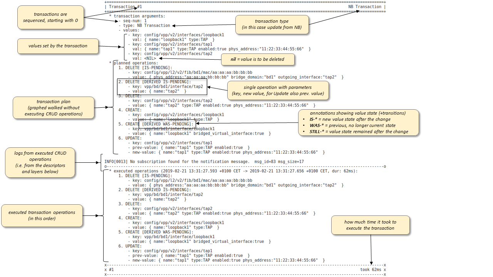
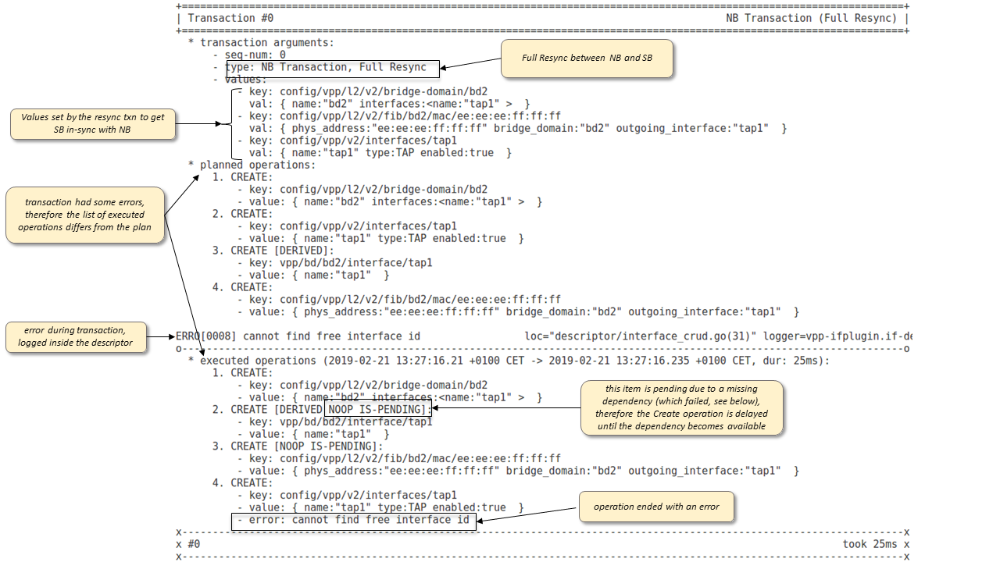
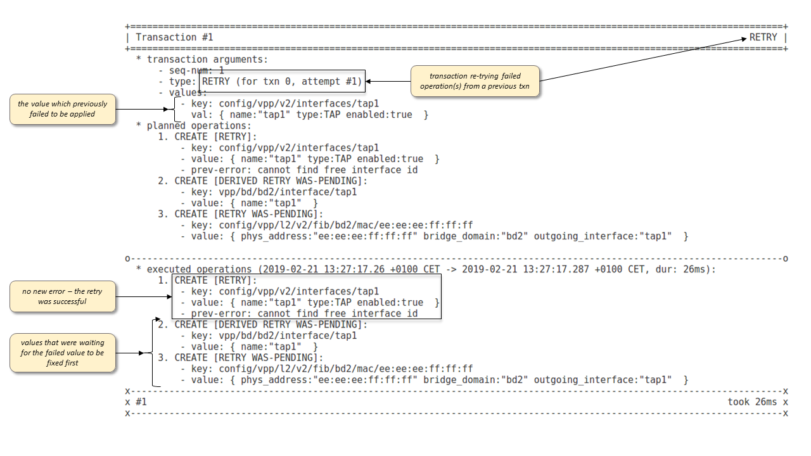
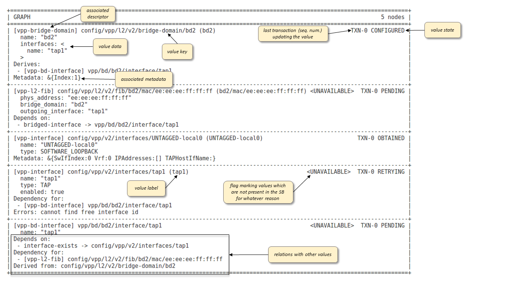
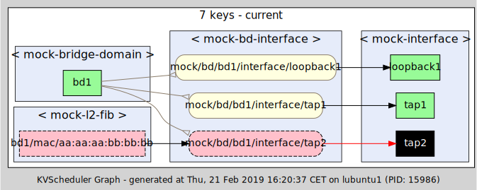
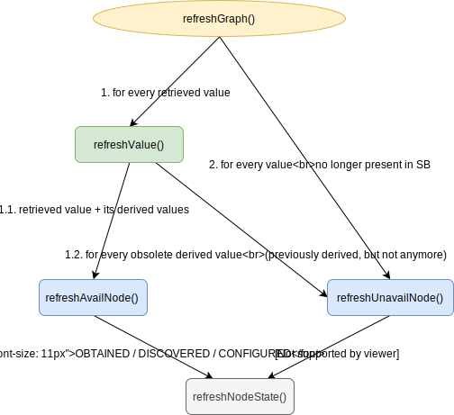
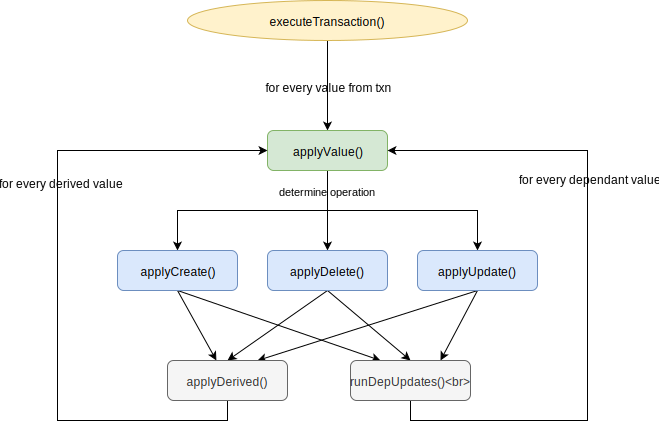

# KVScheduler Debugging Guide

## Index
 * [How-to enable agent debug logs](#how-to-enable-agent-debug-logs)
 * [How-to debug agent plugin lookup](#how-to-debug-agent-plugin-lookup)
 * [How-to list registered descriptors and watched key prefixes](#how-to-list-descriptors)
 * [Understanding transaction log](#understanding-transaction-log)
 * [CRUD verification mode](#crud-verification-mode)
 * [How-to visualize the graph](#how-to-visualize-the-graph)
 * [Understanding the graph walk](#graph-walk)
 
 
## How-to enable agent debug logs

The agent allows to change the log level globally or individually per logger
via configuration file `logging.conf`, environment variable `INITIAL_LOGLVL=<level>`
or even during the agent run-time through the REST API: `POST /log/<logger-name>/<log-level>`
Detailed info can be found in the [documentation for the logmanager plugin][logmanager-readme].

KVScheduler, however, prints most of the interesting stuff, such as the
[transaction logs](#understanding-transaction-log) or the [graph walk log](#understanding-the-graph-walk-(advanced))
directly into `stdout`. This output is made to be concise and easy to read,
providing enough information and visibility to debug and resolve most of the
issues that are in some way related to the KVScheduler framework.
The transaction logs are also quite detached from the implementation details
and not expected to change very much between releases.

KVScheduler-internal debug messages, which require some knowledge of the
underlying implementation, are logged using the logger named `kvscheduler`.

## How-to debug agent plugin lookup

The quickest way to determine if your plugin has been found and properly
initialized by the plugin lookup procedure of the agent, is to enable verbose
lookup logs using the environment variable (before the agent is started):
``` 
export DEBUG_INFRA=lookup
```

Then search for `FOUND PLUGIN: <your-plugin-name>` in the logs - if not found,
it means that your plugin is either not listed among the agent dependencies, or
it does not implement the [plugin interface][plugin-interface].

## <a name="how-to-list-descriptors"></a> How-to list registered descriptors and watched key prefixes

The quickest way to determine what descriptors are registered, is to use the
REST API `GET /scheduler/dump` without any arguments.
For example:
```
$ curl localhost:9191/scheduler/dump
{
  "Descriptors": [
    "vpp-bd-interface",
    "vpp-interface",
    "vpp-bridge-domain",
    "vpp-dhcp",
    "vpp-l2-fib",
    "vpp-unnumbered-interface",
    "vpp-xconnect"
  ],
  "KeyPrefixes": [
    "config/vpp/v2/interfaces/",
    "config/vpp/l2/v2/bridge-domain/",
    "config/vpp/l2/v2/fib/",
    "config/vpp/l2/v2/xconnect/"
  ],
  "Views": [
    "SB",
    "NB",
    "cached"
  ]
}
```

Moreover, with this API you can also find out which key prefixes are being watched
for in the agent NB. This is particularly useful when some value requested by
NB is not being applied into SB. If the value key prefix or the associated
descriptor are not registered, the value will not be even delivered into the
KVScheduler. 

## Understanding transaction log

KVScheduler prints well-formatted and easy-to-read summary of every executed
transaction into `stdout`.The output describes the transaction type, the
assigned sequence number, the values to be changed, the transaction plan prepared
by the scheduling algorithm and finally the actual sequence of executed operations,
which may differ from the plan if there were any errors.
 
Screenshot of an actual transaction output with explanation:



Screenshot of a resync transaction that failed to apply one value:



Retry transaction automatically triggered for the failed operation from the resync
transaction shown above:



Furthermore, before [Full or Downstream Resync](kvscheduler.md#resync) (not for
Upstream Resync), or after a transaction error, the KVScheduler dumps the state
of the graph into `stdout` *after* it was [refreshed](kvscheduler.md#basic-concepts):



## CRUD verification mode

KVScheduler allows to verify correctness of CRUD operations provided by descriptors.
If enabled, the scheduler will trigger verification inside the post-processing
stage of every transaction. The values changed (created/update/deleted) by the
transaction are re-read (using `Retrieve` methods from descriptors) and compared
to check if they are indeed equal to what has been set by the transaction.
A failed check could either mean that the affected values have been changed
externally \- but that is unlikely given that values are re-read practically
immediately after the changes - or, far more likely, some of the CRUD operations
of the corresponding descriptor(s) are not implemented correctly.

The verification mode is costly - `Retrieve` operations are run after every
transaction for descriptors with changed values - therefore it is disabled
by default and not recommended for use in the production environment.

But for the development and testing purposes, the feature is very handy and
allows to quickly discover bugs inside the CRUD operations. We advice to
test newly implemented descriptors in the verification mode before they
are released. Also, consider the use of the feature with the regression test
suites.      

The verification mode is enabled using the environment variable (before the
agent is started):
`export KVSCHED_VERIFY_MODE=1`

Values with read-write inconsistencies are reported in the transaction output
having the [verification error][verification-error] attached. 

## How-to visualize the graph

The graph-based representation of the system state, as used internally by the
KVScheduler, can be displayed using any modern web browser (supporting SVG)
at the URL:
```
http://<host>:9191/scheduler/graph
```
*Note:* 9191 is the default port number for the REST API, but can be changed 
in the configuration file for the [REST plugin][rest-plugin-readme].

The requirement is to have the `dot` renderer from graphviz installed on the
host which is running the agent. The renderer is shipped with the `graphviz`
package, which for Ubuntu can be installed with:
```
root$ apt-get install graphviz
```

An example of rendered graph can be seen below. Graph vertices, drawn as
rectangles, are used to represent key-value pairs. Derived values have rounded
corners. Different fill-colors represent different value states. If you hover
with the mouse cursor over a graph node, a tooltip will pop up, describing the
state and the content of the corresponding value. The edges are used to show
relations between values:
 * black arrows point to dependencies of values they originate from
 * gold arrows connect derived values with their parent values, with cursors
   oriented backwards, pointing to the parents  


Without any GET arguments, the API returns rendering of the graph in its current
state. Alternatively, it is possible to pass argument `txn=<seq-num>`, to display
the graph state as it was when the given transaction has just finalized,
highlighting the vertices updated by the transaction with a yellow border.
For example, to display the state of the graph after the first transaction,
access URL: 
```
http://<host>:9191/scheduler/graph?txn=0
```

We find the graph visualization tremendously helpful for debugging.
It provides an instantaneous global-viewpoint on the system state, often helping
to quickly pinpoint the source of a potential problem (for example: why is my
object not configured?). 

## <a name="graph-walk"></a> Understanding the graph walk (advanced)

To observe and understand how KVScheduler walks through the graph to process
transactions, define environment variable `KVSCHED_LOG_GRAPH_WALK` before
the agent is started, which will enable verbose logs showing how the graph nodes
get visited by the scheduling algorithm.

The scheduler may visit a graph node in one of the transaction processing stages:
1. graph refresh
2. transaction simulation
3. transaction execution

### Graph refresh

During a graph refresh, some or all the registered descriptors are asked to
`Retrieve` the values currently created in the SB. Nodes corresponding to
the retrieved values are refreshed by the method `refreshValue()`. The method
propagates the call further to `refreshAvailNode()` for the node itself and 
for every value which is derived from it and therefore must be also refreshed.
The method updates the value state and its content to reflect the retrieved data.
Obsolete derived values (previously derived, but not anymore with the latest
retrieved revision of the value), are visited with `refreshUnavailNode()`,
marking them as unavailable in the SB.
Finally, the graph refresh procedure visits all nodes for which the values were
not retrieved and marks them as unavailable through method `refreshUnavailNode()`.
The control-flow is depicted by the following diagram:



Example verbose log of graph refresh as printed by the scheduler to stdout:
```
[BEGIN] refreshGrap (keys=<ALL>)
  [BEGIN] refreshValue (key=config/vpp/v2/interfaces/loopback1)
    [BEGIN] refreshAvailNode (key=config/vpp/v2/interfaces/loopback1)
      -> change value state from NONEXISTENT to DISCOVERED
    [END] refreshAvailNode (key=config/vpp/v2/interfaces/loopback1)
  [END] refreshValue (key=config/vpp/v2/interfaces/loopback1)
  [BEGIN] refreshValue (key=config/vpp/v2/interfaces/tap1)
    [BEGIN] refreshAvailNode (key=config/vpp/v2/interfaces/tap1)
      -> change value state from NONEXISTENT to DISCOVERED
    [END] refreshAvailNode (key=config/vpp/v2/interfaces/tap1)
  [END] refreshValue (key=config/vpp/v2/interfaces/tap1)
  [BEGIN] refreshValue (key=config/vpp/v2/interfaces/UNTAGGED-local0)
    [BEGIN] refreshAvailNode (key=config/vpp/v2/interfaces/UNTAGGED-local0)
      -> change value state from NONEXISTENT to OBTAINED
    [END] refreshAvailNode (key=config/vpp/v2/interfaces/UNTAGGED-local0)
  [END] refreshValue (key=config/vpp/v2/interfaces/UNTAGGED-local0)
  [BEGIN] refreshValue (key=config/vpp/l2/v2/bridge-domain/bd1)
    [BEGIN] refreshAvailNode (key=config/vpp/l2/v2/bridge-domain/bd1)
      -> change value state from NONEXISTENT to DISCOVERED
    [END] refreshAvailNode (key=config/vpp/l2/v2/bridge-domain/bd1)
    [BEGIN] refreshAvailNode (key=vpp/bd/bd1/interface/loopback1, is-derived)
      -> change value state from NONEXISTENT to DISCOVERED
    [END] refreshAvailNode (key=vpp/bd/bd1/interface/loopback1, is-derived)
  [END] refreshValue (key=config/vpp/l2/v2/bridge-domain/bd1)
  [BEGIN] refreshValue (key=config/vpp/l2/v2/fib/bd1/mac/02:fe:d9:9f:a2:cf)
    [BEGIN] refreshAvailNode (key=config/vpp/l2/v2/fib/bd1/mac/02:fe:d9:9f:a2:cf)
      -> change value state from NONEXISTENT to OBTAINED
    [END] refreshAvailNode (key=config/vpp/l2/v2/fib/bd1/mac/02:fe:d9:9f:a2:cf)
  [END] refreshValue (key=config/vpp/l2/v2/fib/bd1/mac/02:fe:d9:9f:a2:cf)
[END] refreshGrap (keys=<ALL>)
```

### Transaction simulation / execution

Both the transaction simulation and the execution follow the same algorithm.
The only difference is that during the simulation, the CRUD operations provided
by descriptors are not actually executed, but only pretended to be called with
a nil error value returned. Also, all the graph updates performed during the
simulation are thrown away at the end. If a transaction executes without any
errors, however, the path taken through the graph by the scheduling algorithm
will be the same for both the execution and the simulation.

The main for-cycle of the transaction processing engine visits every value
to be changed by the transaction using the method `applyValue()`. The method
determines which of the `applyCreate()` / `applyUpdate()` / `applyDelete()`
methods to execute, based on the current and the new value data to be applied.

Update of a value often requires some related values to be updated as well - this
is handled through *recursion*. For example, `applyCreate()` will use
`applyDerived()` method to call `applyValue()` for every derived value to be
created as well. Additionally, once the value is created, `applyCreate()` 
will call `runDepUpdates()` to recursively call `applyValue()` for values which
are depending on the created vale and are currently in the PENDING state from
previous transaction, but now with the dependency satisfied are ready to be 
created.
Similarly, `applyUpdate()` and `applyDelete()` may also cause the scheduling
engine to recursively continue and *walk* through the edges of the graph to update
related values.
The control-flow of transaction processing is depicted by the following diagram:
 


Example verbose log of transaction processing as printed by the scheduler to
stdout:
```
[BEGIN] simulate transaction (seqNum=1)
  [BEGIN] applyValue (key = config/vpp/v2/interfaces/tap2)
    [BEGIN] applyCreate (key = config/vpp/v2/interfaces/tap2)
      [BEGIN] applyDerived (key = config/vpp/v2/interfaces/tap2)
      [END] applyDerived (key = config/vpp/v2/interfaces/tap2)
      -> change value state from NONEXISTENT to CONFIGURED
      [BEGIN] runDepUpdates (key = config/vpp/v2/interfaces/tap2)
        [BEGIN] applyValue (key = vpp/bd/bd1/interface/tap2)
          [BEGIN] applyCreate (key = vpp/bd/bd1/interface/tap2)
            -> change value state from PENDING to CONFIGURED
            [BEGIN] runDepUpdates (key = vpp/bd/bd1/interface/tap2)
              [BEGIN] applyValue (key = config/vpp/l2/v2/fib/bd1/mac/aa:aa:aa:bb:bb:bb)
                [BEGIN] applyCreate (key = config/vpp/l2/v2/fib/bd1/mac/aa:aa:aa:bb:bb:bb)
                  [BEGIN] applyDerived (key = config/vpp/l2/v2/fib/bd1/mac/aa:aa:aa:bb:bb:bb)
                  [END] applyDerived (key = config/vpp/l2/v2/fib/bd1/mac/aa:aa:aa:bb:bb:bb)
                  -> change value state from PENDING to CONFIGURED
                  [BEGIN] runDepUpdates (key = config/vpp/l2/v2/fib/bd1/mac/aa:aa:aa:bb:bb:bb)
                  [END] runDepUpdates (key = config/vpp/l2/v2/fib/bd1/mac/aa:aa:aa:bb:bb:bb)
                  [BEGIN] applyDerived (key = config/vpp/l2/v2/fib/bd1/mac/aa:aa:aa:bb:bb:bb)
                  [END] applyDerived (key = config/vpp/l2/v2/fib/bd1/mac/aa:aa:aa:bb:bb:bb)
                [END] applyCreate (key = config/vpp/l2/v2/fib/bd1/mac/aa:aa:aa:bb:bb:bb)
              [END] applyValue (key = config/vpp/l2/v2/fib/bd1/mac/aa:aa:aa:bb:bb:bb)
            [END] runDepUpdates (key = vpp/bd/bd1/interface/tap2)
          [END] applyCreate (key = vpp/bd/bd1/interface/tap2)
        [END] applyValue (key = vpp/bd/bd1/interface/tap2)
      [END] runDepUpdates (key = config/vpp/v2/interfaces/tap2)
      [BEGIN] applyDerived (key = config/vpp/v2/interfaces/tap2)
      [END] applyDerived (key = config/vpp/v2/interfaces/tap2)
    [END] applyCreate (key = config/vpp/v2/interfaces/tap2)
  [END] applyValue (key = config/vpp/v2/interfaces/tap2)
  [BEGIN] applyValue (key = config/vpp/l2/v2/bridge-domain/bd1)
    [BEGIN] applyUpdate (key = config/vpp/l2/v2/bridge-domain/bd1)
      [BEGIN] applyDerived (key = config/vpp/l2/v2/bridge-domain/bd1)
      [END] applyDerived (key = config/vpp/l2/v2/bridge-domain/bd1)
      [BEGIN] applyDerived (key = config/vpp/l2/v2/bridge-domain/bd1)
        [BEGIN] applyValue (key = vpp/bd/bd1/interface/loopback1)
          [BEGIN] applyUpdate (key = vpp/bd/bd1/interface/loopback1)
          [END] applyUpdate (key = vpp/bd/bd1/interface/loopback1)
        [END] applyValue (key = vpp/bd/bd1/interface/loopback1)
        [BEGIN] applyValue (key = vpp/bd/bd1/interface/tap1)
          [BEGIN] applyCreate (key = vpp/bd/bd1/interface/tap1)
            -> change value state from NONEXISTENT to CONFIGURED
            [BEGIN] runDepUpdates (key = vpp/bd/bd1/interface/tap1)
              [BEGIN] applyValue (key = config/vpp/l2/v2/fib/bd1/mac/cc:cc:cc:dd:dd:dd)
                [BEGIN] applyCreate (key = config/vpp/l2/v2/fib/bd1/mac/cc:cc:cc:dd:dd:dd)
                  [BEGIN] applyDerived (key = config/vpp/l2/v2/fib/bd1/mac/cc:cc:cc:dd:dd:dd)
                  [END] applyDerived (key = config/vpp/l2/v2/fib/bd1/mac/cc:cc:cc:dd:dd:dd)
                  -> change value state from PENDING to CONFIGURED
                  [BEGIN] runDepUpdates (key = config/vpp/l2/v2/fib/bd1/mac/cc:cc:cc:dd:dd:dd)
                  [END] runDepUpdates (key = config/vpp/l2/v2/fib/bd1/mac/cc:cc:cc:dd:dd:dd)
                  [BEGIN] applyDerived (key = config/vpp/l2/v2/fib/bd1/mac/cc:cc:cc:dd:dd:dd)
                  [END] applyDerived (key = config/vpp/l2/v2/fib/bd1/mac/cc:cc:cc:dd:dd:dd)
                [END] applyCreate (key = config/vpp/l2/v2/fib/bd1/mac/cc:cc:cc:dd:dd:dd)
              [END] applyValue (key = config/vpp/l2/v2/fib/bd1/mac/cc:cc:cc:dd:dd:dd)
            [END] runDepUpdates (key = vpp/bd/bd1/interface/tap1)
          [END] applyCreate (key = vpp/bd/bd1/interface/tap1)
        [END] applyValue (key = vpp/bd/bd1/interface/tap1)
        [BEGIN] applyValue (key = vpp/bd/bd1/interface/tap2)
          [BEGIN] applyUpdate (key = vpp/bd/bd1/interface/tap2)
          [END] applyUpdate (key = vpp/bd/bd1/interface/tap2)
        [END] applyValue (key = vpp/bd/bd1/interface/tap2)
      [END] applyDerived (key = config/vpp/l2/v2/bridge-domain/bd1)
    [END] applyUpdate (key = config/vpp/l2/v2/bridge-domain/bd1)
  [END] applyValue (key = config/vpp/l2/v2/bridge-domain/bd1)
[END] simulate transaction (seqNum=1)
```


[kvscheduler-graph]: kvscheduler.md#basic-concepts
[logmanager-readme]: ../../vendor/github.com/ligato/cn-infra/logging/logmanager/README.md
[plugin-interface]: https://github.com/ligato/cn-infra/blob/425b8dd352626b88fb36713d7589ac9fc678bdb7/infra/infra.go#L8-L16
[verification-error]: https://github.com/ligato/vpp-agent/blob/de1a2254298d61c5712b8e4d6a4b24648b229f04/plugins/kvscheduler/api/errors.go#L162-L213
[rest-plugin-readme]: ../../vendor/github.com/ligato/cn-infra/rpc/rest/README.md