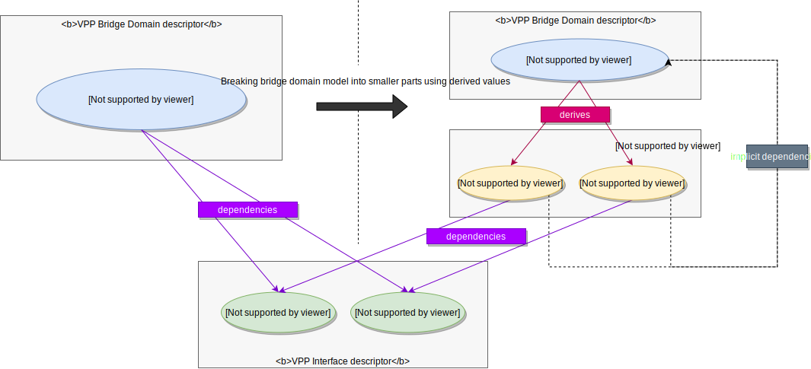

# Implementing your own KVDescriptor

KVDescriptor implements CRUD operations and defines derived values and
dependencies for a single value type. With these "descriptions",
the [KVScheduler](kvscheduler.md) is then able to manipulate the key-value
pairs in a generic way, without having to understand what they actually represent.
The scheduler uses the learned dependencies, reads the south-bound (SB) state
using the `Retrieve` callbacks provided by your Descriptor, and applies the 
`Create`, `Delete` and `Update` operations provided by your Descriptor as needed
to keep the north-bound (NB) in-sync with the SB.

In VPP-Agent v2, all VPP and Linux plugins were re-written (and decoupled
from each other), in a way that every supported configuration item is now
described by its own descriptor inside the corresponding plugin, i.e. there is
a descriptor for [Linux interfaces][linux-interface-descr],
[VPP interfaces][vpp-interface-descr], [VPP routes][vpp-route-descr], etc.
A full list of existing descriptors can be found [here][existing-descriptors].

This design pattern improves modularity and extensibility - VPP Agent v2 is a
collection of loosely coupled plugins to which new plugins that extend the 
Agent's functionality can be easily added. The KVScheduler is not even limited 
to either VPP or Linux as the SB plane. Actually, we can integrated with this
framework any control plane for any system whose configuration and status is 
represented as key-value pairs that can be operated upon via CRUD operations.

The rest of this document provides a step-by-step guide on how to implement your
own KVDescriptor and register it with the KVScheduler.

## Descriptor API

Let's start first by understanding the [descriptor API][descriptor-api].
First of all, a descriptor is not an interface that needs to be implemented, but
rather a structure that needs to be properly initialized with attributes and
callbacks to CRUD operations. This approach was chosen to reinforce the fact 
that descriptors are meant to be **stateless** - the state of values is instead 
kept by the scheduler and run-time information can be stored in 
[metadata](kvscheduler.md#metadata) that is optionally carried with each value. 
The state of the graph with values and their metadata should determine what 
exactly will be executed next in the SB plane for a given transaction. The graph
is already exposed through logs and programmatic and REST APIs, therefore if 
descriptors do not store any state internally, the system state will be fully 
visible from the outside.

The following sub-sections describe all descriptor attributes inf detail and 
provide pointers to examples. 

Please note that using [descriptor adapters](#descriptor-adapter), the signatures
of the callbacks will become adapted to use the real proto message type
(e.g. `*vpp_l3.Route`) as opposed to the bare `proto.Message` interface, avoiding
all the boiler-plate type casting. 

**Note**: `KeySelector`, `ValueTypeName`, `KeyLabel` & `NBKeyPrefix`
will all be replaced in a future release with a single reference to the value
[model](kvscheduler.md#model) (**TODO: add link to the model documentation
once it exists**). Most descriptors already use the methods provided by models
to define these fields. But we do not yet have tools to build models for
[derived values](#derivedvalues) and without them we cannot fully switch
to models.

Please note that all optional fields can be left uninitialized (zero values).

### Name

* `string` attribute, **mandatory**
* name (ID) of the descriptor
* it MUST be unique across all registered descriptors from all initialized
  plugins

### NBKeyPrefix

* `string` attribute, optional
* key prefix that the scheduler should watch in an NB (for example, `etcd`) to receive
  all values described by this descriptor
* descriptors for derived values do not need to define this field - the values
  they describe do not come from NB directly, instead get derived from other
  values which are in scope of other descriptors
* [model](kvscheduler.md#model) can be used to obtain the key prefix
  using the `KeyPrefix()` method - [here is an example][nb-key-prefix]

### KeySelector

* **mandatory** callback: `func(key string) bool`
* a predicate that should select (i.e. return true) for keys identifying values
  described by this descriptor
* typically, a selector uses the `IsKeyValid` method from the value 
  [model](kvscheduler.md#model) to check if the key is valid for the model 
  \- [here is an example][key-selector]

### ValueTypeName

* `string` attribute, **mandatory for [non-derived values](#derivedvalues)**
* name of the protobuf message used to structure and serialize value data
* [model](kvscheduler.md#model) can be used to obtain the proto message name
  using `ProtoName()` method - [here is an example][value-type-name]

### KeyLabel

* optional callback: `func(key string) string`
* "a key shortener" - function that will receive a key and should return a value
   identifier, that, unlike the original key, only needs to be unique in the
   key scope of the descriptor and not necessarily in the entire key space
   (e.g. interface name rather than the full key)
* [model](kvscheduler.md#model) provides an off-the-shelf key shortener
  method `StripKeyPrefix()` - [here is an example][key-label]
* if defined, KeyLabel will be used as value identifier in the metadata map
  (it then, for example, allows to ask for interface metadata simply by the
  interface name rather than using a full key)

### ValueComparator

* optional callback: `func(key string, oldValue, newValue proto.Message) bool`
* allows to optionally customize how two values are compared for equality
* typically, the scheduler will compare two values of the same key using the 
  `proto.Equal`method to determine if the `Update` operation is needed
* sometimes, however, different values for the same field may be effectively
  equivalent - [for example][compare-mtu], we want to treat MTU 0 (default)
  as equivalent to MTU 1500 (i.e. change from 0 to 1500 or vice-versa should 
  not trigger an `Update`)

### WithMetadata

* `boolean` attribute, optional, by default `false`
* enable if values should carry run-time metadata alongside the configuration
* metadata allows to maintain extra state data that may change with CRUD
  operations or after agent restart and cannot be determined just from the
  value itself (e.g. sw_if_index for interface)
* metadata are often used in [Retrieve](#retrieve) to correlate NB configuration
  with retrieved SB data
* metadata are not supported with [derived values](#derivedvalues)
* **note**: in a future release the term "metadata" will be renamed to "statedata"

### MetadataMapFactory

* optional callback: `func() idxmap.NamedMappingRW`
* can be used to provide a customized map implementation for value metadata,
  possibly extended with additional secondary lookups
* if not defined, the scheduler will use the bare [NamedMapping][named-mapping]
  from the idxmap package
* for example, VPP [ifplugin][vpp-ifplugin] implements custom map called
  [ifaceidx][vpp-ifaceidx], which allows to [lookup interfaces by assigned
  IP addresses][vpp-iface-by-ip], among other things

### Validate

* optional callback: `func(key string, value proto.Message) error`
* can be provided to implement validation of the value data received from NB
  (e.g. check for validity of interface configuration)
* `Validate` is called for every new value before it is Created or Updated into
* if the validations fails (returned error is non-nil), the scheduler will
  mark the value as invalid ([state][value-states] `INVALID`) and will not
  attempt to apply it
* the descriptor can further specify which field(s) are not valid by wrapping
  the validation error together with a slice of invalid fields using the error
  [InvalidValueError][invalid-val-error].
* for example, interface cannot be both unnumbered and at the same time have
  IP address assigned - this is validated [here][unnumbered-validation]

### Create

* callback: `func(key string, value proto.Message) (metadata interface{}, err error)`
* "C" from CRUD, implements the operation to create a new value
* **mandatory for descriptors that describe values received from NB**, but
  optional for descriptors with only `OBTAINED` values in their scope - i.e.
  values received from SB via notifications as already created
* for non-derived values, descriptor may return metadata to associate with
  the value
* KVScheduler ensures that all dependencies are satisfied when the Create
  callback is called
* for example, the descriptor for VPP ARP entries simply [adds new ARP entry][vpp-arp-create]
  defined by the value with configuration - it knows that the associated
  interface it depends on is guaranteed to already exist by the scheduling
  algorithm and can therefore [read the interface index from its metadata][vpp-arp-get-iface-index],
  needed to build request for VPP

### Delete

* callback: `func(key string, value proto.Message, metadata Metadata) error`
* "D" from CRUD, implements the operation to delete an existing value
* **mandatory for descriptors that describe values received from NB**, but
  optional for descriptors with only `OBTAINED` values in their scope - i.e.
  values received from SB via notifications as already created
* KVScheduler ensures that all items that depend on a value which is being
  removed are deleted first and their state is set to `PENDING`
* for example, the descriptor for VPP ARP entries simply [removes existing ARP entry][vpp-arp-delete],
  knowing that the scheduling algorithm guarantees that the associated interfaces,
  marked as a dependency of the ARP entry, will not be removed before the
  ARP entry and therefore the interface index that is required to build the
  delete request for VPP, can still be [read from the interfaces metadata][vpp-arp-get-iface-index]

### Update

* callback: `func(key string, oldValue, newValue proto.Message, oldMetadata interface{}) (newMetadata interface{}, err error)`
* "U" from CRUD, implements the operation to update an existing value
* the callback is optional - if undefined, updates will be always performed
  via re-creation, i.e. calling `Delete(key, oldValue, oldMetadata)` followed by
  `newMetadata, err = Create(key, newValue)`
* the current value metadata, passed to the callback as `oldMetadata`, can be
  edited in-place (i.e. without deep-copying) and returned as `newMetadata`
* sometimes an SB does not support incremental configuration updates - for 
  example, changing the interface type (e.g. going from VETH to TAP) cannot
  be done without fully re-creating the interface - on the other hand, Linux
  [interface host name can be changed][linux-rename-interface] via a dedicated
  netlink call

### UpdateWithRecreate

* optional callback: `func(key string, oldValue, newValue proto.Message, oldMetadata interface{}) (newMetadata interface{}, err error)`
* sometimes, for some or all kinds of its updates, an SB plane does not provide
  specific Update operations; instead, the value must be re-created, by calling
  `Delete(key, oldValue, oldMetadata)` followed by `newMetadata, err = Create(key, newValue)`
* through this callback the KVScheduler can be informed if a given value change
  requires full re-creation
* if not defined, the KVScheduler will decide based on the (un)availability of 
  the `Update` operation - if provided, it is assumed that any change can be 
  applied incrementally, otherwise a full re-creation is the only way to go
* [for example][vpp-iface-recreate], changing VPP interface type (e.g. going
  from MEMIF to TAP) cannot be done without fully re-creating the interface

### Retrieve

* optional callback: `func(correlate []KVWithMetadata) ([]KVWithMetadata, error)`
  - where [KVWithMetadata][kvwithmetadata] is defined as:
    ```go
    type KVWithMetadata struct {
        Key      string
        Value    proto.Message
        Metadata Metadata
        Origin   ValueOrigin
    }
    ```
* "R" from CRUD, implements the operation to read the real-time snapshot of the 
  SB plane configuration for all values in descriptor's scope 
* it is a key operation for state reconciliation (or as we call it - "resync"),
  as it gives the KVScheduler the ability to refresh it's view of the SB and 
  determine the sequence of `Create`/`Update`/`Delete` operations needed to get 
  the actual state (SB) in-sync with the intended state (NB)
* it is optional in the sense that, if not provided, it is assumed that the
  `Retrieve` operation is not supported and therefore the state of SB for the
  given value type cannot be refreshed and will be assumed to be up-to-date
  (note that in particular after an agent restart this might not be the case)
* the input argument `correlate` represents the non-derived values currently created
  or getting applied as viewed from the northbound/scheduler point of view:
    - startup resync: `correlate` = values received from NB to be applied
	- run-time/downstream resync: `correlate` = cached values taken and applied
	  from the graph of values stored in-memory (scheduler's cached view of SB)

### IsRetriableFailure

* callback: `func(err error) bool`
* optionally tell the scheduler if a given error, returned by one of the
  `Create`/`Delete`/`Update` callbacks, will always be returned for the same
  value (non-retriable) or if the value can be theoretically fixed merely by
  repeating the operation (retriable)
* if the callback is not defined, every C(R)UD error will be considered retriable
* validation errors (returned from [Validate](#validate)) are automatically
  considered non-retriable - no matter how many times an invalid configuration
  is re-applied, it is still invalid and the operation would fail 
* if a C(R)UD operation fails with a retriable error and the associated
  (`best-effort`) transaction [allows Retry][retry-opt], the KVscheduler will
  schedule repeat for these failed operations to run in a separate transaction,
  triggered after a configurable time delay and with a limit to the maximum
  number of retries allowed - it can be requested to double the delay for every
  next attempt, feature known as exponential backoff

### DerivedValues

* optional callback: `func(key string, value proto.Message) []KeyValuePair`
* to break a complex value into multiple pieces managed separately by different
  descriptors, implement and provide the `DerivedValues` callback
* a derived value is typically a single field of the original value or its
  property, with possibly its own dependencies (dependency on the source value
  is implicit, i.e. source value is created before its derived values), separate
  CRUD operations and potentially used as a target for dependencies of other
  key-value pairs
* for example, every [interface to be assigned to a bridge domain][bd-interface]
  is treated as a [separate key-value pair][bd-derived-vals], dependent on
  the [target interface to be created first][bd-iface-deps], but otherwise
  not blocking the rest of the bridge domain to be applied - a use-case depicted
  by the following diagram:



### Dependencies

* optional callback: `func(key string, value proto.Message) []Dependency`
  - where [Dependency][kvdependency] is defined as:
    ```go
    type Dependency struct {
    	Label string
    	Key string
    	AnyOf KeySelector
    }
    
    type KeySelector func(key string) bool
    ```
* for value that has one or more dependencies, provide a callback that will
  tell which keys must already exist for the value to be considered ready
  for creation
* for a dependency to be considered satisfied, the dependency can either 
  reference a specific key or use the predicate `AnyOf`, which must return 
  `true` for at least one of the keys of some already created values (i.e.
  matching keys are basically ORed)
* the callback is optional - if not defined, the kv-pairs of the descriptor
  are assumed to have no dependencies
* multiple listed dependencies must all be satisfied - i.e. they are ANDed
* [a basic example][vpp-arp-deps] is ARP entry which cannot be created until
  the associated interface exists
* [a more complex dependency][linux-route-gw-dep], which cannot be expressed
  using a static key but requires `AnyOf` selector, can be found in the
  linux/l3plugin: a Linux route cannot be created (request will fail) if the
  selected gateway (next hop) isn't already routable based on IP addresses
  assigned to interfaces from the same namespace or using link-local routes
  \- the implemented `AnyOf` selector returns `true` whenever it finds just such
  interface or a link-local route among already configured/obtained values

### RetrieveDependencies

* optional attribute, slice of strings
* if, in order to `Retrieve` values, some other descriptors must have
  their respective values refreshed first, here you can list them woth this
  attribute
* [for example][vpp-route-retrieve-deps], in order to retrieve routes and
  re-construct their configuration for NB models, interfaces must be retrieved
  first, to learn the mapping between interface names (NB ID) and their indices
  (SB ID) from the metadata map of the interface plugin
  - this is because the retrieved routes will reference outgoing interfaces
    through SB indexes, which need to be [translated into the logical names from
    NB][vpp-route-iface-name]

## Descriptor Adapter

One inconvenience that you will quickly discover when using this generalized
approach of unified value descriptions, is that the KVDescriptor API uses bare
`proto.Message` interface for all values. It means that if you used the KVScheduler
APIs directly, you would not be able to define the Create, Update, Delete and 
other callbacks using data structures from your model, but rather you would have
to use `proto.Message` for input and output parameters and do all the re-typing
inside the callbacks, introducing lot's of boiler-plate code into your descriptors.

To remove this drawback, the KVScheduler is shipped with a utility called
[descriptor-adapter][descriptor-adapter]. It generated an adapter for a given
value type that will prepare and hide all the type conversions. The tool can
be installed as follows:

```sh
make get-desc-adapter-generator
```

Then, to generate an adapter for your descriptor, put the `go:generate` command
for the `descriptor-adapter` to (preferably) your plugin's main go file:
```go
//go:generate descriptor-adapter --descriptor-name <your-descriptor-name>  --value-type <your-value-type-name> [--meta-type <your-metadata-type-name>] [--import <IMPORT-PATH>...] --output-dir "descriptor"
```
Available arguments are:
* `output-dir`: output directory where the "adapter" package will be generated
  - optional, current working directory is the default
  - it is recommended to generate an adapter under the directory with the descriptor,
    therefore all the VPP and Linux plugins use `--output-dir "descriptor"`
* `descriptor-name`: name of the descriptor
  - mandatory argument
  - can be a shortcut for the full descriptor name to avoid an overly long 
    generated type and variable names - the only requirement is that it is 
    unique among adapters for the same plugin
* `value-type`: type of the described values, e.g. `*vpp_l2.BridgeDomain`,
  `*vpp_l3.Route`, etc.
  - mandatory argument
* `meta-type`: type of the metadata carried along values, e.g. `*aclidx.ACLMetadata`
  (ACL metadata), `*idxvpp.OnlyIndex` (generic metadata storing only object
  index used in VPP), etc.
  - optional argument, by default metadata are used with undefined type
    (`interface{}`)
* `import`: list of packages to import into the generated adapter to get
  the definition of the value type (i.e. package with the protobuf model) and, if
  used, also for metadata type
  - repeated and optional argument, but since `value-type` is mandatory, at least
    the package with the protobuf model of the value should be imported
  - import path can be relative to the file with the `go:generate` command
    (hence the plugin's top-level directory is preferred to avoid double dots)

For example, `go:generate` for VPP interface can be found [here][vpp-iface-adapter].
Running `go generate <your-plugin-path>` will generate the adapter for your
descriptor into `adapter` directory under `output-dir`.

## Registering Descriptor

Once you have your adapter generated and the CRUD callbacks prepared, you can 
initialize and register your descriptor.
First, import the adapter into the go file with the descriptor
([assuming recommended directory layout](#plugin-directory-layout)):

```go
import "github.com/<your-organization>/<your-agent>/plugins/<your-plugin>/descriptor/adapter"
```

Next, add a constructor that will return your descriptor initialized and ready for
registration with the scheduler. The adapter will present the KVDescriptor API with
the value type and metadata type already casted to your own data types for every 
field:

```go
func New<your-descriptor-name>Descriptor(<args>) *adapter.<your-descriptor-name>Descriptor {
    return &adapter.<your-descriptor-name>Descriptor{
        Name:        <your-descriptor-name>,
        KeySelector: <your-key-selector>,
        Create:      <your-Create-operation-implementation>,
        // etc., fill all the mandatory fields or whenever the default value is not suitable
    }
}
```

Next, inside the `Init` method of your plugin, import the package with all your
descriptors and register them using the 
[KVScheduler.RegisterKVDescriptor(<DESCRIPTOR>)][register-kvdescriptor] method:
	
```go
import "github.com/<your-organization>/<your-agent>/plugins/<your-plugin>/descriptor"

func (p *YourPlugin) Init() error {
    yourDescriptor1 = descriptor.New<descriptor-name>Descriptor(<args>)
    p.Deps.KVScheduler.RegisterKVDescriptor(yourDescriptor1)
    //...
}
```

As you can see, the KVScheduler becomes a plugin dependency, which needs to be
properly injected:

```go
// main.go
import kvs "github.com/ligato/vpp-agent/plugins/kvscheduler/api"

type Deps struct {
    infra.PluginDeps
    KVScheduler kvs.KVScheduler
    //...
}
```

```go
// options.go
import kvs "github.com/ligato/vpp-agent/plugins/kvscheduler"

func NewPlugin(opts ...Option) *<your-plugin> {
    p := &<your-plugin>{}
    //...
    p.KVScheduler = &kvs.DefaultPlugin
    //...
    return p
}
```

<a name="expose-metadata">In order to obtain and expose the metadata map</a>
(if used), call [KVScheduler.GetMetadataMap(<Descriptor-Name>)][get-metadata-map],
after the descriptor has been registered, which will give you a map reference
that can be then passed further via plugin's own API for other plugins to access
read-only. An example for VPP interface metadata map can be found
[here][get-metadata-map-example].

## Plugin Directory Layout

While it is not mandatory, we recommend to follow the same directory layout used
across all the VPP-Agent plugins:

```
<your-plugin>/
├── model/  // + protobuf-generated code
│   ├── model1.proto
│   ├── model2.proto
│   ├── ...
│   └── <modeln>.proto
├── descriptor/
│   ├── adapter/
│   │   ├── <generated-adapter-for-every-descriptor>
│   │   └──...
│   ├── <descriptor-for-model1>.go  // e.g. "acl.go"
│   ├── <descriptor-for-model2>.go
│   ├── ...
│   └── <descriptor-for-modeln>.go
├── <southband-name>calls/  // e.g. "vppcalls/"
├── <metadata-map>  // if custom secondary index for metadata is needed
│   └── <map-impl>.go
├── <your-plugin>.go
├── <your-plugin>_api.go
└── options.go
```

Directory `model` is where you would put all your proto models and the code
generated from it.

`descriptor` directory is a place for all the descriptorsvimplemented by your
plugin, optionally adapted for a specific protobuf type with generated adapters
nested further in the sub-directory `adapter` (adapters are quite hidden since
they should never need to be looked at and definitely not edited manually).

It is recommended to put the implementation of every SB call requires for your
descriptor into a separate package `<southband-name>calls/`
(e.g. [linuxcalls][linuxcalls]) and expose them via an interface. This will allow
to replace access to SB with mocks and make unit testing easier.

If you define a custom metadata map, put its implementation into a separate
plugin's top-level directory, called, for example, `<model>idx`.

`<your-plugin.go>` is where you would implement the Plugin interface
(`Init`, `AfterInit`, `Close` methods) and register all the descriptors within
the `Init` phase.

`<your-plugin>_api.go` is a place to define API of your plugin - plugins most
commonly [expose read-only references to maps with metadata](#expose-metadata)
for configuration items they describe.

It is a good practice to put the plugin constructor and some default options
and default dependency injections into the file `options.go` (example
[option.go][options-example] for VPP ifplugin).

## Descriptor examples

### Descriptor skeletons

For a quick start, you may use prepared skeleton of a plugin with a single
descriptor, available in two variants:
 * [without leveraging the support for metadata][plugin-skeleton-withoutmeta]
 * [with metadata, including custom metadata index map][plugin-skeleton-withmeta]

**Beware**: extensive copy-pasting is actually a bad practise, so use the
provided skeletons with caution and eventually learn how to write your own
plugins from the scratch, using the skeletons only as a reference.

### Mock SB

We have prepared an [interactive hands-on example][mock-plugins-example],
demonstrating the KVScheduler framework using replicated `vpp/ifplugin` and
`vpp/l2plugin` under various scenarios, where models are simplified and the VPP
is replaced with a mock southbound, printing the triggered CRUD operations into
the stdout instead of actually executing them. The example is fully focused on
the scheduler and the descriptors, and on that abstraction level the actual SB
underneath is irrelevant.

### Real-world examples

Since all VPP and Linux plugins use the KVScheduler framework, there are
already many descriptors in the repository to look at and clone. Even though
interfaces are the basis of network configuration, we recommend to start studying
descriptors for simpler objects, such as [VPP ARPs][vpp-arp-descriptor] and 
[VPP routes][vpp-route-descriptor], which have simple CRUD methods and a single
dependency on the associated interface. Then, learn how to break a more complex
object into multiple values using [bridge domains][vpp-bd-descriptor] and 
[BD-interface bindings][vpp-bd-iface-descriptor], derived one for every
interface to be assigned into the domain, as an example. Finally, check out the
[Linux interface watcher][linux-iface-watcher], which shows that values may enter
the graph even from below as SB notifications, and used as [targets for dependencies][afpacket-dep]
by other objects.
These descriptors cover most of the features and should help you to get started
implementing your own.


[existing-descriptors]: https://github.com/ligato/vpp-agent/wiki/KVDescriptors
[linux-interface-descr]: https://github.com/ligato/vpp-agent/blob/master/plugins/linux/ifplugin/descriptor/interface.go
[vpp-interface-descr]: https://github.com/ligato/vpp-agent/blob/master/plugins/vpp/ifplugin/descriptor/interface.go
[vpp-route-descr]: https://github.com/ligato/vpp-agent/blob/master/plugins/vpp/l3plugin/descriptor/route.go
[descriptor-api]: https://github.com/ligato/vpp-agent/blob/e8e54ef67b666e57ffef1bca555c8ce5585f215f/plugins/kvscheduler/api/kv_descriptor_api.go#L82-L248
[descriptor-adapter]: https://github.com/ligato/vpp-agent/tree/master/plugins/kvscheduler/descriptor-adapter
[vpp-iface-adapter]: https://github.com/ligato/vpp-agent/blob/e8e54ef67b666e57ffef1bca555c8ce5585f215f/plugins/vpp/ifplugin/ifplugin.go#L15
[register-kvdescriptor]: https://github.com/ligato/vpp-agent/blob/e8e54ef67b666e57ffef1bca555c8ce5585f215f/plugins/kvscheduler/api/kv_scheduler_api.go#L195-L199
[get-metadata-map]: https://github.com/ligato/vpp-agent/blob/e8e54ef67b666e57ffef1bca555c8ce5585f215f/plugins/kvscheduler/api/kv_scheduler_api.go#L228-L231
[get-metadata-map-example]: https://github.com/ligato/vpp-agent/blob/e8e54ef67b666e57ffef1bca555c8ce5585f215f/plugins/vpp/ifplugin/ifplugin.go#L177-L183
[options-example]: https://github.com/ligato/vpp-agent/blob/master/plugins/vpp/ifplugin/options.go
[vpp-arp-descriptor]: https://github.com/ligato/vpp-agent/blob/master/plugins/vpp/l3plugin/descriptor/arp_entry.go
[vpp-route-descriptor]: https://github.com/ligato/vpp-agent/blob/master/plugins/vpp/l3plugin/descriptor/route.go
[vpp-bd-descriptor]: https://github.com/ligato/vpp-agent/blob/master/plugins/vpp/l2plugin/descriptor/bridgedomain.go
[vpp-bd-iface-descriptor]: https://github.com/ligato/vpp-agent/blob/master/plugins/vpp/l2plugin/descriptor/bd_interface.go
[linux-iface-watcher]: https://github.com/ligato/vpp-agent/blob/master/plugins/linux/ifplugin/descriptor/watcher.go
[afpacket-dep]: https://github.com/ligato/vpp-agent/blob/e8e54ef67b666e57ffef1bca555c8ce5585f215f/plugins/vpp/ifplugin/descriptor/interface.go#L421-L426
[value-type-name]: https://github.com/ligato/vpp-agent/blob/e8e54ef67b666e57ffef1bca555c8ce5585f215f/plugins/linux/ifplugin/descriptor/interface.go#L145
[key-label]: https://github.com/ligato/vpp-agent/blob/e8e54ef67b666e57ffef1bca555c8ce5585f215f/plugins/linux/ifplugin/descriptor/interface.go#L147
[key-selector]: https://github.com/ligato/vpp-agent/blob/e8e54ef67b666e57ffef1bca555c8ce5585f215f/plugins/linux/ifplugin/descriptor/interface.go#L146
[nb-key-prefix]: https://github.com/ligato/vpp-agent/blob/e8e54ef67b666e57ffef1bca555c8ce5585f215f/plugins/linux/ifplugin/descriptor/interface.go#L144
[compare-mtu]: https://github.com/ligato/vpp-agent/blob/e8e54ef67b666e57ffef1bca555c8ce5585f215f/plugins/linux/ifplugin/descriptor/interface.go#L191-L194
[named-mapping]: https://github.com/ligato/cn-infra/blob/master/idxmap/mem/inmemory_name_mapping.go
[vpp-ifaceidx]: https://github.com/ligato/vpp-agent/tree/master/plugins/vpp/ifplugin/ifaceidx
[vpp-iface-by-ip]: https://github.com/ligato/vpp-agent/blob/master/plugins/vpp/ifplugin/ifaceidx/ifaceidx.go#L135-L139
[vpp-ifplugin]: https://github.com/ligato/vpp-agent/tree/master/plugins/vpp/ifplugin
[value-states]: https://github.com/ligato/vpp-agent/blob/master/plugins/kvscheduler/api/value_status.proto
[invalid-val-error]: https://github.com/ligato/vpp-agent/blob/e8e54ef67b666e57ffef1bca555c8ce5585f215f/plugins/kvscheduler/api/errors.go#L124-L160
[unnumbered-validation]: https://github.com/ligato/vpp-agent/blob/e8e54ef67b666e57ffef1bca555c8ce5585f215f/plugins/vpp/ifplugin/descriptor/interface.go#L380-L385
[vpp-arp-create]: https://github.com/ligato/vpp-agent/blob/e8e54ef67b666e57ffef1bca555c8ce5585f215f/plugins/vpp/l3plugin/descriptor/arp_entry.go#L79-L85
[vpp-arp-get-iface-index]: https://github.com/ligato/vpp-agent/blob/e8e54ef67b666e57ffef1bca555c8ce5585f215f/plugins/vpp/l3plugin/vppcalls/arp_vppcalls.go#L27-L37
[vpp-arp-delete]: https://github.com/ligato/vpp-agent/blob/e8e54ef67b666e57ffef1bca555c8ce5585f215f/plugins/vpp/l3plugin/descriptor/arp_entry.go#L88-L93
[linux-rename-interface]: https://github.com/ligato/vpp-agent/blob/e8e54ef67b666e57ffef1bca555c8ce5585f215f/plugins/linux/ifplugin/descriptor/interface.go#L413-L420
[linuxcalls]: https://github.com/ligato/vpp-agent/tree/master/plugins/linux/ifplugin/linuxcalls
[vpp-iface-recreate]: https://github.com/ligato/vpp-agent/blob/e8e54ef67b666e57ffef1bca555c8ce5585f215f/plugins/vpp/ifplugin/descriptor/interface.go#L393
[retry-opt]: https://github.com/ligato/vpp-agent/blob/e8e54ef67b666e57ffef1bca555c8ce5585f215f/plugins/kvscheduler/api/txn_options.go#L136-L184
[bd-interface]: https://github.com/ligato/vpp-agent/blob/e8e54ef67b666e57ffef1bca555c8ce5585f215f/api/models/vpp/l2/bridge-domain.proto#L19-L23
[bd-derived-vals]: https://github.com/ligato/vpp-agent/blob/e8e54ef67b666e57ffef1bca555c8ce5585f215f/plugins/vpp/l2plugin/descriptor/bridgedomain.go#L240-L251
[bd-iface-deps]: https://github.com/ligato/vpp-agent/blob/e8e54ef67b666e57ffef1bca555c8ce5585f215f/plugins/vpp/l2plugin/descriptor/bd_interface.go#L119-L127
[vpp-arp-deps]: https://github.com/ligato/vpp-agent/blob/e8e54ef67b666e57ffef1bca555c8ce5585f215f/plugins/vpp/l3plugin/descriptor/arp_entry.go#L116-L126
[linux-route-gw-dep]: https://github.com/ligato/vpp-agent/blob/e8e54ef67b666e57ffef1bca555c8ce5585f215f/plugins/linux/l3plugin/descriptor/route.go#L255-L273
[vpp-route-retrieve-deps]: https://github.com/ligato/vpp-agent/blob/e8e54ef67b666e57ffef1bca555c8ce5585f215f/plugins/vpp/l3plugin/descriptor/route.go#L74
[vpp-route-iface-name]: https://github.com/ligato/vpp-agent/blob/e8e54ef67b666e57ffef1bca555c8ce5585f215f/plugins/vpp/l3plugin/vppcalls/route_dump.go#L139-L150
[mock-plugins-example]: ../../examples/kvscheduler/mock_plugins/README.md
[plugin-skeleton-withmeta]: ../../examples/kvscheduler/plugin_skeleton/with_metadata/plugin.go
[plugin-skeleton-withoutmeta]: ../../examples/kvscheduler/plugin_skeleton/without_metadata/plugin.go
[kvwithmetadata]: https://github.com/ligato/vpp-agent/blob/73970d00f781ee136436d70cc8c9890742641c70/plugins/kvscheduler/api/kv_scheduler_api.go#L76
[kvdependency]: https://github.com/ligato/vpp-agent/blob/73970d00f781ee136436d70cc8c9890742641c70/plugins/kvscheduler/api/kv_descriptor_api.go#L24