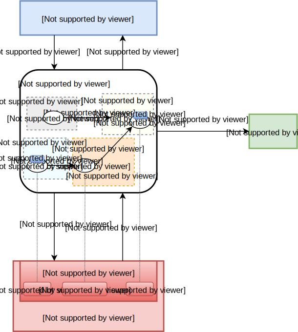

# KVScheduler

A major enhancement that led to the increase of the agent's major version number
from 1.x to 2.x, is an introduction of a new framework, called **KVScheduler**.
It provides transaction-based configuration processing with a generic mechanism
for dependency resolution between configuration items, which in effect
simplifies and unifies the configurators. KVScheduler is shipped as a separate
[plugin], even though it is now a core component used by all VPP and
Linux configurators.

## Motivation

KVScheduler is a reaction to a series of drawbacks of the original design, which
gradually arose with the set of supported configuration items growing:
* plugins `vpp` and `linux` became bloated and complicated, suffering with race
  conditions and a lack of visibility
* the `configurators` - i.e. components of `vpp` and `linux` plugins, each
  processing a specific configuration item type (e.g. interface, route, etc.),
  had to be effectively built from scratch, solving the same set of problems
  again and duplicating lot's of code
* configurators would communicate with each other only through notifications,
  and react to changes asynchronously to ensure proper operation ordering - i.e.
  the problem of dependency resolution was effectively distributed across all
  configurators, making it very difficult to understand, predict and stabilise
  the system behaviour from the developer's global viewpoint
* at a certain scale, the relationships between all the supported configuration
  items became impractical to reason about
* a culmination of all the issues above was an unreliable and unpredictable
  re-synchronization (or resync for short), also known as state reconciliation,
  between northbound (desired state) and southbound (actual state) - something
  that was meant to be marketed as the main feature of the VPP-Agent

## Basic concepts

KVScheduler uses graph theory concepts to manage dependencies between configuration i
tems and therir respective proper operation ordering. A level of abstraction is build
on top of configurators (from now on just "plugins"), where the state of the system 
is modeled as a graph; configuration items are represented as vertices and relations
between them are represented as edges. The graph is then walked through to generate 
transaction plans, refresh the state, execute state reconciliation, etc.

The transaction plan that is prepared using the graph representation consists of a 
series of CRUD operations to be executed on some of the graph vertices. To 
abstract from specific configuration items and details on how to manipulate them,
graph vertices are "described" to KVScheduler in a unified way via 
[KVDescriptors][kvdescriptor-guide]. KVDescriptors are basically handlers, each
assigned to a distinct subset of graph vertices, providing the scheduler with
pointers to callbacks that, among other things, implement CRUD operations.

KVDescriptors are based on the Mediator pattern, where plugins are decoupled and no
longer communicate directly, but instead interact with each other through a mediator
(the KVScheduler). Plugins only have to provide CRUD callbacks and describe their 
dependencies on other plugins through one or more KVDescriptors. The scheduler is 
then able to plan operations without even knowing what the graph vertices actually
represent in the configured system. Furthermore, the set of supported configuratio
n items can be easily extended without altering the transaction processing engine
or increasing the complexity of any of the components - simply by implementing and 
registering new descriptors.

### Terminology

The graph-based system representation uses new terminology to abstract from
concrete objects:

* **Model** builds a representation for a single item type (e.g. interface, route,
  bridge domain, etc.); it uses a Protobuf Message to structure and serialize
  configuration data, further coupled with meta-specification used
  to categorize the item type and to build/parse keys for/of item instances
  (for example, the Bridge Domain model can be found [here][bd-model-example]).
  
  **TODO: add link to the model documentation once it exists**
  
* **Value** (`proto.Message`) is a run-time instance of a given model.

* **Key** (`string`) identifies a specific value - it is built using the model
  specification and value attributes that uniquely identify the instance.

* **Label** (`string`) provides a shorter identifier that is unique only across
  value of the same type (e.g. interface name) - similar to the key, it is 
  generated using from the model specification and primary value fields.

* **Value State** (`enum ValueState`) is the operational state of a value. For
  example, a value can be successfully `CONFIGURED`, or `PENDING` due to unmet
  dependencies, or in a `FAILED` state after the last CRUD operation returned
  an error. The set of value states is defined using the protobuf enumerated type 
  [here][value-states].

* **Value Status** (`struct BaseValueStatus`): Value State is associated with 
  further details, such as the last executed operation, the last returned error,
  or the list of unmet dependencies. The status of one or more values and their
  updates can be read and watched for via the [KVScheduler API][value-states-api].
  More information on this API can be found [below](#API).

* **Metadata** (`interface{}`) is additional run-time information (of undefined
  type) assigned to a value. It is typically updated after a CRUD operation or 
  after agent restart. An example of metadata is the [sw_if_index][vpp-iface-idx],
  which is kept for every interface alongside its value. The name "metadata" was
  inherited from VPP-Agent v1.x and it is rather a misnomer - metadata is in fact
  the "state data" for its associated value. Furthermore, in a future release we 
  plan to support user-defined metadata labels - an extensible meta-information, 
  assigned to key-value pairs by the NB to describe the semantic purpose of 
  configuration items for layers above the KVScheduler (i.e. opaque to the scheduling
  algorithm). Metadata will be renamed to **Statedata**, and it will be allowed to 
  change not only through CRUD operations, but also asynchronously through 
  notifications.

* **Metadata Map**, also known as index-map, implements the mapping between a value
  label and its metadata for a given value type. It is typically exposed in read-only
  mode to allow other plugins to read and reference metadata. For example, the 
  interface plugin exposes its metadata map [here][vpp-iface-map]; it is used by the
  ARP Plugin, the Route Plugin, and other plugins to read the sw_if_index of target
  interfaces. Metadata maps are automatically created and updated by scheduler (it
  is the owner), and exposed to other plugins in read-only mode.

* **[Value origin][value-origin]** defines where the value came from - whether
  it was received from NB to be configured or whether it was created in the SB
  plane automatically (e.g. default routes, loop0 interface, etc.).

* Key-value pairs are operated with through CRUD operations: **C**reate,
  **R**etrieve, **U**pdate and **D**elete.

* **Dependency** defined for a value, references another key-value pair that
  must exist (be created), otherwise the associated value cannot be Created and
  must remain cached in the state `PENDING` - value is allowed to have defined
  multiple dependencies and all must be satisfied for the value to be considered
  ready for creation.

* **Derived value**, in a future release to be renamed to **attribute** for more
  clarity, is typically a single field of the original value or its property,
  manipulated separately - i.e. with possibly its own dependencies (dependency
  on the source value is implicit), custom implementations for CRUD operations
  and potentially used as target for dependencies of other key-value pairs - for
  example, every [interface to be assigned to a bridge domain][bd-interface] is
  treated as a [separate key-value pair][bd-derived-vals], dependent on the
  [target interface to be created first][bd-iface-deps], but otherwise not
  blocking the rest of the bridge domain to be applied - see [control-flow][bd-cfd]
  demonstrating the order of operations needed to create a bridge domain.

* **Graph** of values is a kvscheduler-internal in-memory storage for all
  configured and pending key-value pairs, with edges representing inter-value
  relations, such as "depends-on" and "is-derived-from".
  
  *Note:* configurators - now just "plugins" - no longer have to implement their
  own caches for pending values.  
  
* **Graph Refresh** is a process of updating the graph content to reflect the
  real state of the southbound. This is achieved by calling `Retrieve` of
  every descriptor that supports the operation and adding/updating vertices
  with retrieved values. The refresh is performed just before [Full or Downstream
  resync](#resync) or after a failed C(R)UD operation(s), but only for vertices
  affected by the failure.

* **KVDescriptor** assigns implementations of CRUD operations and defines
  derived values and dependencies to a single value type - this is what
  configurators basically boil down to - to learn more, please read how to
  [implement your own KVDescriptor](Implementing-your-own-KVDescriptor).

### Dependencies

The scheduler learns two kinds of relations between values that have to be
respected by the scheduling algorithm:
1. `A` **depends on** `B`:
   - `A` cannot exist without `B`
   - request to Create `A` without `B` existing must be postponed by marking
     `A` as `PENDING` (value with unmet dependencies) in the in-memory graph
   - if `B` is to be removed and `A` exists, `A` must be removed first and set
     to the `PENDING` state in case `B` is restored in the future
   - Note: values obtained from SB via notifications are not checked for
     dependencies
2. `B` **is derived from** `A`:
   - value `B` is not created directly (by NB or SB) but gets derived from base
     value `A` (using the `DerivedValues()` method of the descriptor for `A`)
   - derived value exists only as long as its base does and gets removed
     (immediately, not pending) once the base value goes away
   - derived value may be described by a different descriptor than the base and
     usually represents property of the base value (that other values may depend
     on) or an extra action to be taken when additional dependencies are met.

### Diagram

The easiest way to understand KVScheduler is through a graphical visualization.
In the following diagram we show how the scheduler interacts with the layers
above and below. A minimalistic graph sketch shows both dependency and
derivation relations using [bridge domain][bd-cfd] as an example, together with
a pending value (of unspecified type) waiting for some interface to be created
first.



## Resync

Plugins no longer have to implement resync (state reconciliation) on their own.
As they "teach" KVScheduler how to operate with configuration items by providing
callbacks to CRUD operations through KVDescriptors, the scheduler has all it
needs to determine and execute the set of operations needed to get the state
in-sync after a transaction or restart.

Furthermore, KVScheduler enhances the concept of state reconciliation, and
differentiates three types of the resync:
* **Full resync**: desired configuration is re-read from NB, the view of SB is
  refreshed via `Retrieve` operations and inconsistencies are resolved via
  `Create`\\`Delete`\\`Update` operations
* **Upstream resync**: partial resync, same as Full resync except the view of SB
  is assumed to be up-to-date and will not get refreshed - can be used by NB
  when it is easier to re-calculate the desired state than to determine the
  (minimal) difference to reflect a given event
* **Downstream resync**: partial resync, same as Full resync except the desired
  configuration is assumed to be up-to-date and will not be re-read from
  NB - can be used periodically to resync, even without interacting with NB

## Transactions

The scheduler allows to group related changes and apply them as transactions.
This is not supported, however, by all agent NB interfaces - for example,
changes from `etcd` datastore are always received one a time. To leverage
the transaction support, localclient (the same process) or GRPC API (remote
access) have to be used instead (both defined [here][clientv2]).

Inside the scheduler, transactions are queued and executed synchronously to
simplify the algorithm and avoid concurrency issues. The processing of
a transaction is split into two stages:
* **Simulation**: the set of operations to execute and their order is determined
 (so-called *transaction plan*), without actually calling any CRUD callbacks
 from the descriptors - assuming no failures.
* **Execution**: executing the operations in the right order. If any operation
 fails, the already applied changes are reverted, unless the so called
 `BestEffort` mode is enabled, in which case the scheduler tries to apply the
 maximum possible set of required changes. `BestEffort` is default for resync.

Right after simulation, transaction metadata (sequence number printed as `#xxx`,
description, values to apply, etc.) are printed, together with the transaction
plan. This is done before execution, to ensure that the user is informed about
the operations that were going to be executed even if any of the operations
causes the agent to crash. After the transaction has executed, the set of actually
executed operations and potentially some errors are printed to finalize the
output for transaction.

An example transaction output printed to logs (in this case there were no errors,
therefore the plan matches the executed operations):
```
+======================================================================================================================+
| Transaction #5                                                                                        NB transaction |
+======================================================================================================================+
  * transaction arguments:
      - seq-num: 5
      - type: NB transaction
      - Description: example transaction
      - values:
          - key: vpp/config/v2/nat44/dnat/default/kubernetes
            value: { label:"default/kubernetes" st_mappings:<external_ip:"10.96.0.1" external_port:443 local_ips:<local_ip:"10.3.1.10" local_port:6443 > twice_nat:SELF >  }
          - key: vpp/config/v2/ipneigh
            value: { mode:IPv4 scan_interval:1 stale_threshold:4  }
  * planned operations:
      1. ADD:
          - key: vpp/config/v2/nat44/dnat/default/kubernetes
          - value: { label:"default/kubernetes" st_mappings:<external_ip:"10.96.0.1" external_port:443 local_ips:<local_ip:"10.3.1.10" local_port:6443 > twice_nat:SELF >  }
      2. MODIFY:
          - key: vpp/config/v2/ipneigh
          - prev-value: { scan_interval:1 max_proc_time:20 max_update:10 scan_int_delay:1 stale_threshold:4  }
          - new-value: { mode:IPv4 scan_interval:1 stale_threshold:4  }

// here you would potentially see logs from C(R)UD operations           
          
o----------------------------------------------------------------------------------------------------------------------o
  * executed operations (2019-01-21 11:29:27.794325984 +0000 UTC m=+8.270999232 - 2019-01-21 11:29:27.797588466 +0000 UTC m=+8.274261700, duration = 3.262468ms):
     1. ADD:
         - key: vpp/config/v2/nat44/dnat/default/kubernetes
         - value: { label:"default/kubernetes" st_mappings:<external_ip:"10.96.0.1" external_port:443 local_ips:<local_ip:"10.3.1.10" local_port:6443 > twice_nat:SELF >  }
      2. MODIFY:
          - key: vpp/config/v2/ipneigh
          - prev-value: { scan_interval:1 max_proc_time:20 max_update:10 scan_int_delay:1 stale_threshold:4  }
          - new-value: { mode:IPv4 scan_interval:1 stale_threshold:4  }
x----------------------------------------------------------------------------------------------------------------------x
x #5                                                                                                          took 3ms x
x----------------------------------------------------------------------------------------------------------------------x
```

## API

The API of KVScheduler is defined inside a separate [sub-package "api"][kvscheduler-api-dir]
of the [plugin][plugin]. A set of available interfaces is split across multiple
files:
 * `errors.go`: definitions of errors that can be returned from within
   the scheduler; additionally `InvalidValueError` error wrapper is defined
   to allow plugins further specify the reason of a [validation error][kvdescriptor-validate],
   which is then exposed through the [value status][value-states]

 * `kv_scheduler_api.go`: the API of scheduler that can be used:
   - by NB to commit transaction or to read and watch for value status updates
   - by SB to push notifications about values created/updated automatically or
     externally

 * `kv_descriptor_api.go`: defines the interface of a KVDescriptor, a detailed
   description can be found in a separate [guide][kvdescriptor-guide]

 * `txn_options.go`: a set of available options for transactions - for example,
   a transaction can be customized to allow re-try of failed operations,
   triggered after a configured time period and with a given limit to the maximum
   number of retries allowed

 * `txn_record.go`: type definition used to store a record of already processed
   transaction - these records can be obtained using either [GetTransactionHistory][get-history-api]
   method or through the [REST API](#rest-api)

 * `value_status.proto`: operational value status defined using protobuf
   \- [the API][value-states-api] allows to read the current status of one or
   more values and also to watch for updates through a channel

 * `value_status.pb.go`: golang code generated from `value_status.proto`

 * `value_status.go`: further extends `value_status.pb.go` to implement proper
   (un)marshalling for proto Messages (so not really part of API definitions)


### REST API

KVScheduler exposes the state of the system and the history of operations not
only via formatted logs but also through a set of REST APIs:
* **graph visualization**: `GET /scheduler/graph`
    - returns graph visualization plotted into SVG image using graphviz
      (can be displayed using any modern web browser)
    - for example: [graph][graph-example] rendered for the [Contiv/VPP][contiv-vpp]
      project
    - *requirements*: `dot` renderer;
      on Ubuntu can be installed with: `apt-get install graphviz`
      (not needed when argument `format=dot` is used)
    - args:
        - `format=dot`: if defined, the API returns plain graph description
          in the DOT format, available for further processing and customized
          rendering
        - `txn=<txn-number>`: visualize the state of the graph as it was at the
          time when the given transaction had just finalized; vertices updated
          by the transaction are highlighted using a yellow border
* **transaction history**: `GET /scheduler/txn-history`
    - returns the full history of executed transactions or only for a given time
      window
    - args:
        - `format=<json/text>`
        - `seq-num=<txn-seq-num>`: transaction sequence number
        - `since=<unix-timestamp>`: if undefined, the output starts with the
           oldest kept record
        - `until=<unix-timestamp>`: if undefined, the output ends with the last
           executed transaction
* **key timeline**: `GET /scheduler/key-timeline`
     - args:
        - `key=<key-without-agent-prefix>`: key of the value to show changes
           over time for
* **graph snapshot** (internal representation, not using `dot`): `GET /scheduler/graph-snaphost`
    - args:
        - `time=<unix-timestamp>`: if undefined, current state is returned
* **dump values**: `GET /scheduler/dump`
    - args (without args prints Index page):
        - `descriptor=<descriptor-name>`: dump values in the scope of the given
           descriptor
        - `key-prefix=<key-prefix>`: dump values with the given key prefix
        - `view=<NB, SB, internal>`: whether to dump desired, actual or the
           configuration state as known to KVScheduler
* **request downstream resync**: `POST /scheduler/downstream-resync`
    - args:
        - `retry=< 1/true | 0/false >`: allow to retry operations that failed
          during resync
        - `verbose=< 1/true | 0/false >`: print graph after refresh (Retrieve)

[plugin]: https://github.com/ligato/vpp-agent/tree/master/plugins/kvscheduler
[bd-model-example]: https://github.com/ligato/vpp-agent/blob/e8e54ef67b666e57ffef1bca555c8ce5585f215f/api/models/vpp/l2/keys.go#L27-L31
[vpp-iface-idx]: https://github.com/ligato/vpp-agent/blob/e8e54ef67b666e57ffef1bca555c8ce5585f215f/plugins/vpp/ifplugin/ifaceidx/ifaceidx.go#L62
[vpp-iface-map]: https://github.com/ligato/vpp-agent/blob/e8e54ef67b666e57ffef1bca555c8ce5585f215f/plugins/vpp/ifplugin/ifplugin_api.go#L27
[value-origin]: https://github.com/ligato/vpp-agent/blob/e8e54ef67b666e57ffef1bca555c8ce5585f215f/plugins/kvscheduler/api/kv_descriptor_api.go#L53
[bd-interface]: https://github.com/ligato/vpp-agent/blob/e8e54ef67b666e57ffef1bca555c8ce5585f215f/api/models/vpp/l2/bridge-domain.proto#L19-L24
[bd-derived-vals]: https://github.com/ligato/vpp-agent/blob/e8e54ef67b666e57ffef1bca555c8ce5585f215f/plugins/vpp/l2plugin/descriptor/bridgedomain.go#L242-L251
[bd-iface-deps]: https://github.com/ligato/vpp-agent/blob/e8e54ef67b666e57ffef1bca555c8ce5585f215f/plugins/vpp/l2plugin/descriptor/bd_interface.go#L120-L127
[bd-cfd]: cfd/bridge_domain.md
[contiv-vpp]: https://github.com/contiv/vpp/
[graph-example]: img/graph-example.svg
[clientv2]: https://github.com/ligato/vpp-agent/tree/master/clientv2
[value-states]: https://github.com/ligato/vpp-agent/blob/master/plugins/kvscheduler/api/value_status.proto
[value-states-api]: https://github.com/ligato/vpp-agent/blob/e8e54ef67b666e57ffef1bca555c8ce5585f215f/plugins/kvscheduler/api/kv_scheduler_api.go#L233-L239
[kvscheduler-api-dir]: https://github.com/ligato/vpp-agent/tree/master/plugins/kvscheduler/api
[kvdescriptor-guide]: kvdescriptor.md
[kvdescriptor-validate]: kvdescriptor.md#Validate
[get-history-api]: https://github.com/ligato/vpp-agent/blob/e8e54ef67b666e57ffef1bca555c8ce5585f215f/plugins/kvscheduler/api/kv_scheduler_api.go#L241-L244
