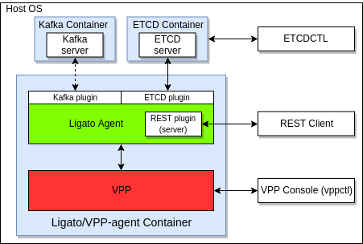

This page is a quickstart how-to guide for the vpp-agent

# Vpp-agent quickstart guide 

You will learn how to:
- install the vpp-agent
- install and use the ETCD and Kafka
- run the vpp-agent container
- interact with the vpp-agent

Table of content:

- [1. Prerequisites](#prerequisites)
- [2. Get the agent image from the dockerhub](#image)
- [3. Prepare the ETCD](#etcd)
  - [3.1 Get the ETCD image](#etcdget)
  - [3.2 Install the ETCD client](#etcdclient)
- [4. Start Kafka](#kafka)  
- [5. Start the vpp-agent](#startagent)
- [6. Manage the vpp-agent](#manage)
  - [6.1 Configure the VPP using the vpp-agent](#manageconf)
  - [6.2 Read the VPP configuration via the vpp-agent API](#manageread)
  - [6.3 Read the status provided by the vpp-agent](#managestatus)
  - [6.4 Connect to the VPP in the container](#managevpp)
- [Troubleshooting](#troubleshooting)  

### <a name="prerequisites">1. Prerequisites</a>

- **Docker** (docker ce [installation manual](https://docs.docker.com/cs-engine/1.13/))
- **Postman** or **cURL** tool (postman [installation manual](https://learning.getpostman.com/docs/postman/launching_postman/installation_and_updates/)) 
- **ETCD** 
- **Kafka**


The result of this guide prepares following topology:


### <a name="image">2. Get the agent image from the dockerhub</a>

The command will download the vpp-agent image (vpp-agent + compatible vpp) from the [dockerhub](https://hub.docker.com/u/ligato):
```bash
docker pull ligato/vpp-agent
```

or for the development image:

```bash
docker pull ligato/dev-vpp-agent:dev
```

The command `docker images` shows us that the image exists:

```bash
REPOSITORY                  TAG                 IMAGE ID            CREATED             SIZE   
ligato/vpp-agent            latest              17b7db787662        18 hours ago        175MB
```

The `docker ps` should not contain any mention about the vpp-agent in the output, since we did not start the image yet.

### <a name="etcd">3. Prepare the ETCD</a>

#### <a name="etcdget">3.1 Get the ETCD image</a>

Following command starts the ETCD in a docker container. If you do not have the image, it will be downloaded first:

```bash
docker run -p 2379:2379 --name etcd --rm quay.io/coreos/etcd:v3.1.0 /usr/local/bin/etcd -advertise-client-urls http://0.0.0.0:2379 -listen-client-urls http://0.0.0.0:2379
```

Verify the ETCD container is running with `docker ps -f name=etcd`:
```bash
CONTAINER ID        IMAGE                        COMMAND                  CREATED             STATUS              PORTS                              NAMES
f3db6e6d8975        quay.io/coreos/etcd:v3.1.0   "/usr/local/bin/etcd…"   16 minutes ago      Up 16 minutes       0.0.0.0:2379->2379/tcp, 2380/tcp   etcd
```

#### <a name="etcdclient">3.2 Install the ETCD client</a>

The `etcdctl` is the official ETCD client which can be used to put/delete/read data from the ETCD:

```bash
// Linux users
apt-get install etcd-client

// MAC users
brew install etcd
```

According to the documentation, the etcdctl API version must be set. We need the third version:

```bash
export ETCDCTL_API=3
```

Verify that the following command does not print any error:

```bash
etcdctl get --prefix /vnf-agent
```

Check the ETCD version (also prints the version of the API):
```bash
etcdctl --version
```

### <a name="kafka">4. Start Kafka</a>

Following command starts Kafka in a docker container. If you do not have the image, it will be downloaded first:

```bash
docker run -p 2181:2181 -p 9092:9092 --name kafka --rm --env ADVERTISED_HOST=172.17.0.1 --env ADVERTISED_PORT=9092 spotify/kafka
```

Verify the Kafka container is running with `docker ps -f name=kafka`:
```bash
CONTAINER ID        IMAGE               COMMAND             CREATED             STATUS              PORTS                                            NAMES
dd9bb1a482c5        spotify/kafka       "supervisord -n"    25 seconds ago      Up 24 seconds       0.0.0.0:2181->2181/tcp, 0.0.0.0:9092->9092/tcp   kafka
```

**Note:** the vpp-agent v2.0.0 (not released yet) and later do not need kafka running by default.

### <a name="startagent">5. Start the vpp-agent</a>

The command starts the Ligato vpp-agent together with the compatible version of the VPP in new docker container:
```bash
docker run -it --rm --name vpp-agent -p 5002:5002 -p 9191:9191 --privileged ligato/vpp-agent
``` 

or for the development image:
```bash
docker run -it --rm --name vpp-agent -p 5002:5002 -p 9191:9191 --privileged ligato/dev-vpp-agent:dev
```

Verify the vpp-agent container is running with command `docker ps -f name=vpp-agent`:
```bash
CONTAINER ID        IMAGE               COMMAND                  CREATED             STATUS              PORTS                                            NAMES
77df69266072        ligato/vpp-agent    "/bin/sh -c 'rm -f /…"   26 seconds ago      Up 25 seconds       0.0.0.0:5002->5002/tcp, 0.0.0.0:9191->9191/tcp   vpp-agent
```

The following command opens vpp-agent container console:
```bash
docker exec -it vpp-agent bash
```

### <a name="manage">6. Manage the vpp-agent</a>

This section is divided into several parts:
- how to configure the VPP providing data to the vpp-agent
- how to read VPP configuration asking the vpp-agent
- how to obtain the status (stored in the ETCD) provided by the vpp-agent
- how to connect to the VPP cli and verify the configuration 

#### <a name="manageconf">6.1 Configure the VPP using the vpp-agent</a>

In this step we configure a simple loopback interface with an IP address putting the key-value data to the ETCD:
```bash
etcdctl put /vnf-agent/vpp1/config/vpp/v2/interfaces/loop1 '{"name":"loop1","type":"SOFTWARE_LOOPBACK","enabled":true,"ip_addresses":["192.168.1.1/24"]}'
```

Let's add a bridge domain:
```bash
etcdctl put /vnf-agent/vpp1/config/vpp/l2/v2/bridge-domain/bd1 '{"name":"bd1","forward":true,"learn":true,"interfaces":[{"name":"loop1"}]}'
```

Verify the configuration is present in the ETCD:
```bash
etcdctl get /vnf-agent/vpp1/config/vpp/v2/interfaces/loop1
etcdctl get /vnf-agent/vpp1/config/vpp/l2/v2/bridge-domain/bd1
```

The output should return the data configured.

#### <a name="manageread">6.2 Read the VPP configuration via the vpp-agent API</a>

This command returns the list of VPP interfaces accessing the vpp-agent REST API:
```bash
curl -X GET http://localhost:9191/dump/vpp/v2/interfaces
```

Two interfaces are returned in the output - the loopback interface with internal name `loop0` present in the vpp by default, and another loopback interface configured in the previous step.

Another command to read the bridge domain:
```bash
curl -X GET http://localhost:9191/dump/vpp/v2/bd
```

URLs can be used to get the same data via postman:
```bash
http://localhost:9191/dump/vpp/v2/interfaces
http://localhost:9191/dump/vpp/v2/bd
```
#### <a name="managestatus">6.3 Read the status provided by the vpp-agent</a>

The vpp-agent publishes interface status to the ETCD. Obtain the status for the `loop1` interface (configured in 5.1):
```bash
etcdctl get /vnf-agent/vpp1/vpp/status/v2/interface/loop1
```

Output:
```bash
{"name":"loop1","internal_name":"loop0","if_index":1,"admin_status":"UP","oper_status":"UP","last_change":"1551866265","phys_address":"de:ad:00:00:00:00","mtu":9216,"statistics":{}}
```

Notice the `internal_name` assigned by the VPP as well as the `if_index`. The `statistics` section contain traffic data (received/transmitted packets, bytes, ...). Since there is no traffic at the VPP, statistics are empty.

**Note:** state is exposed only for interfaces (including default interfaces).

#### <a name="managevpp">6.4 Connect to the VPP in the container</a>

Following command opens the VPP-cli:
```bash
vppctl -s localhost:5002
```

Output:
```bash
    _______    _        _   _____  ___ 
 __/ __/ _ \  (_)__    | | / / _ \/ _ \
 _/ _// // / / / _ \   | |/ / ___/ ___/
 /_/ /____(_)_/\___/   |___/_/  /_/    

vpp# 
```

The cli is ready to accept VPP commands. For example, command `show interface` or `sh int` shows configured interfaces:
```bash
vpp# show interface 
              Name               Idx    State  MTU (L3/IP4/IP6/MPLS)     Counter          Count     
local0                            0     down          0/0/0/0       
loop0                             1      up          9000/0/0/0     
vpp# 
```

We can see the default `local0` interface and `loop0` configured by the vpp-agent.

The command `sh br` shows the configured bridge domain:
```bash
vpp# sh br
  BD-ID   Index   BSN  Age(min)  Learning  U-Forwrd   UU-Flood   Flooding  ARP-Term   BVI-Intf 
    1       1      0     off        on        on        drop       off       off        N/A    
vpp# 
```

Short version of commands (without opening VPP-cli):
```bash
docker exec -it vpp-agent vppctl -s localhost:5002 sh int
docker exec -it vpp-agent vppctl -s localhost:5002 sh int addr
docker exec -it vpp-agent vppctl -s localhost:5002 sh br
```

### <a name="troubleshooting">Troubleshooting</a>

**The vpp-agent container was started and immediately closed.**

The ETCD or Kafka containers are not running. Please verify they are running using command `docker ps`.

**The etcdctl command returns "Error:  100: Key not found".**

The etcdctl API version was not correctly set. Check the output of the appropriate environment variable with command `echo $ETCDCTL_API`. If the version is not set to "3", make it so with `export ETCDCTL_API=3`.

**The cURL or Postman command to access vpp-agent API does not work (connection refused).**

The command starting docker container exports port 9191 to allow access from the host. Make sure that the vpp-agent docker container is started with parameter `-p 9191:9191`.  

**The cURL or Postman command to access VPP-cli does not work (connection refused).**

The command starting docker container exports port 5002 (the VPP default port) to allow access from the host. Make sure that the vpp-agent docker container is started with parameter `-p 5002:5002`.