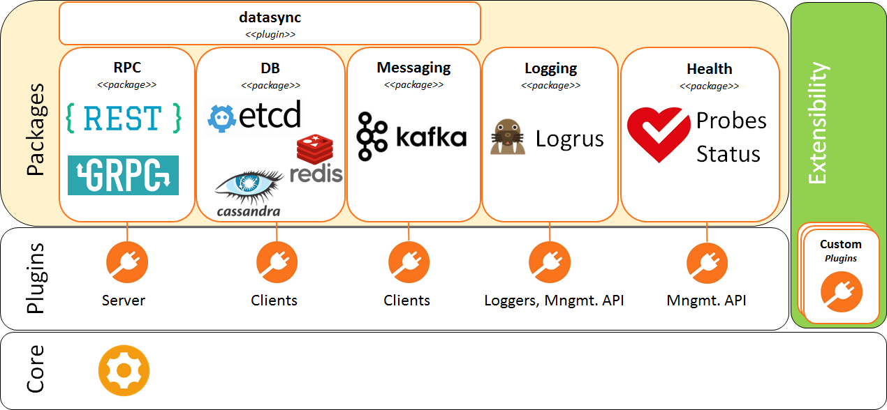

# CN-Infra

[](https://travis-ci.org/ligato/cn-infra)
[](https://coveralls.io/github/ligato/cn-infra?branch=master)
[](https://goreportcard.com/report/github.com/ligato/cn-infra)
[](https://godoc.org/github.com/ligato/cn-infra)
[](https://github.com/ligato/cn-infra/blob/master/LICENSE.md)

CN-Infra (cloud-native infrastructure) is a Golang framework for building
control plane agents for cloud-native Virtual Network Functions It is
basically a collection of components/libraries used in most control plane 
agents tied together with a common life-cycle management mechanism.

#### Available CN-Infra Plugins:

A CN-Infra plugin is typically implemented as a library providing the 
plugin's functionality/APIs wrapped in a plugin wrapper. A CN-Infra 
library can also be used standalone in 3rd party apps that do not use
the CN-Infra framework. The plugin wrapper provides lifecycle management 
for the plugin component.

Plugins in the current CN-Infra release provide functionality in one of 
the following functional areas:

* **RPC** - allows to expose application's API:
  - [GRPC][docs-grpc] - handles GRPC requests and allows app plugins to define
    their own GRPC services
  - [REST][docs-rest] - handles HTTP requests and allows app plugins to define
    their own REST APIs
  - Prometheus - serves Prometheus metrics via HTTP and allows
    app plugins to register their own collectors
        
* **Data Stores** - provides a common data store API for app plugins (the 
    Data Broker) and back-end clients. The data store related plugins are:
  - [Consul][docs-consul] - key-value data store adpater for Consul
  - [Etcd][docs-etcd] - key-value data store adpater for Etcd
  - [Redis][docs-redis] - key-value data store adpater for Redis
  - [Casssandra][cassandra] - key-value data store adpater for Cassandra
  - [FileDB][docs-filedb] - key-value data store using OS filesystem
    
* **Messaging** - provides a common API and connectivity to message buses:
  - [Kafka][docs-kafka] - adapter for the Kafka message bus (built on top of
    Sarama)
    
* **Logging**:
  - [Logrus wrapper][logrus] - implements logging skeleton 
    using the Logrus library. An app writer can create multiple loggers -
    for example, each app plugin can have its own logger. Log level
    for each logger can be controlled individually at run time through
    the Log Manager REST API.
  - [Log Manager][docs-logmanager] - allows the operator to set log
    level for each logger using a REST API.
    
* **Health Monitoring** - Self health check mechanism between plugins 
    plus RPCs:
  - [StatusCheck][docs-statuscheck] - allows to monitor the status of plugins
    and exposes it via HTTP
  - [Probe][probe] - callable remotely from K8s
  
* **Miscellaneous** - value-add plugins supporting the operation of a 
    CN-Infra based application: 
  - [Config][config] - helpers for loading plugin configuration.
  - [Datasync][resync] - provides data resynchronization after HA 
    events (restart or connectivity restoration after an outage) for data
    stores, gRPC and REST.
  - [IDX Map][idx-map] - reusable thread-safe map with advanced features:
    * multiple subscribers for watching changes in the map
    * secondary indexes
  - [ServiceLabel][docs-service-label] - provides setting and retrieval of a 
      unique identifier for a CN-Infra based app. A cloud app typically needs
      a unique identifier so that it can differentiated from other instances 
      of the same app or from other apps (e.g. to have its own space in a kv 
      data store).


## Quickstart

You can run this example code by using pre-build Docker images:

For quick start with the VPP Agent, you can use pre-build Docker images with the Agent and VPP
on [Dockerhub][dockerhub].

1. Run ETCD and Kafka on your host (e.g. in Docker 
  [using this procedure][simple-agent]).

2. Run cn-infra example [simple-agent][simple-agent].
```
docker pull ligato/dev-cn-infra
docker run -it --name dev-cn-infra --rm ligato/dev-cn-infra
```

A very simple example of a control plane agent that uses Etcd as its configuration data store 
is as follows:
```
func main() {

	// Create agent with connector plugins
	a := agent.NewAgent(agent.AllPlugins(
		&etcd.DefaultPlugin,
		&resync.DefaultPlugin,
	))

	if err := a.Run(); err != nil {
		log.Fatal(err)
	}
}
```
You can find the above example [here][simple-agent], from where it can be 
compiled and run in your favorite environment.

## Documentation

Detailed documentation (including tutorials) can be found [here][ligato].

GoDocs can be browsed [online][godocs].

## Architecture

Each management/control plane app built on top of the CN-Infra framework is 
basically a set of modules called "plugins" in CN-Infra lingo, where each 
plugin provides a very specific/focused functionality. Some plugins are 
provided by the CN-Infra framework itself, some are written by the app's 
implementors. In other words, the CN-Infra framework itself is implemented
as a set of plugins that together provide the framework's functionality, 
such as logging, health checks, messaging (e.g. Kafka), a common front-end
API and back-end connectivity to various KV data stores (Etcd, Cassandra, 
Redis, ...), and REST and gRPC APIs. 

The architecture of the CN-Infra framework is shown in the following figure.



The CN-Infra framework consists of a **[Agent][agent]** that provides plugin
lifecycle management (initialization and graceful shutdown of plugins) 
and a set of framework plugins. Note that the figure shows not only 
CN-Infra plugins that are a part of the CN-Infra framework, but also 
app plugins that use the framework. CN-Infra framework plugins provide 
APIs that are consumed by app plugins. App plugins themselves may 
provide their own APIs consumed by external clients.

The framework is modular and extensible. Plugins supporting new functionality
(e.g. another KV store or another message bus) can be easily added to the
existing set of CN-Infra framework plugins. Moreover, CN-Infra based apps
can be built in layers: a set of app plugins together with CN-Infra plugins
can form a new framework providing APIs/services to higher layer apps. 
This approach was used in the [VPP Agent][vpp-agent] - a management/control agent
for [VPP][vpp] based software data planes.,

Extending the code base does not mean that all plugins end up in all 
apps - app writers can pick and choose only those framework plugins that 
are required by their app; for example, if an app does not need a KV 
store, the CN-Infra framework KV data store plugins would not be included
in the app. All plugins used in an app are statically linked into the 
app.
   
## Contributing

If you are interested in contributing, please see the [contribution guidelines](CONTRIBUTING.md).

[agent]: agent
[cassandra]: db/sql/cassandra
[config]: config
[dockerhub]: https://hub.docker.com/r/ligato/dev-cn-infra/
[docs-consul]: https://docs.ligato.io/en/latest/plugins/db-plugins/#consul-plugin
[docs-etcd]: https://docs.ligato.io/en/latest/plugins/db-plugins/#etcd-plugin
[docs-grpc]: https://docs.ligato.io/en/latest/plugins/connection-plugins/#vpp-agent-grpc
[docs-kafka]: https://docs.ligato.io/en/latest/plugins/plugin-overview/#messagingkafka
[docs-logmanager]: https://docs.ligato.io/en/latest/plugins/infra-plugins/#log-manager
[docs-statuscheck]: https://docs.ligato.io/en/latest/plugins/infra-plugins/#status-check
[docs-redis]: https://docs.ligato.io/en/latest/plugins/db-plugins/#redis
[docs-rest]: https://docs.ligato.io/en/latest/plugins/connection-plugins/#rest-plugin
[docs-service-label]: https://docs.ligato.io/en/latest/plugins/infra-plugins/#service-label
[godocs]: https://godoc.org/github.com/ligato/vpp-agent
[idx-map]: idxmap
[ligato]: https://docs.ligato.io
[logrus]: logging/logrus
[probe]: health/probe
[resync]: datasync/resync
[simple-agent]: examples/simple-agent/README.md
[vpp]: https://fd.io
[vpp-agent]: https://github.com/ligato/vpp-agent
