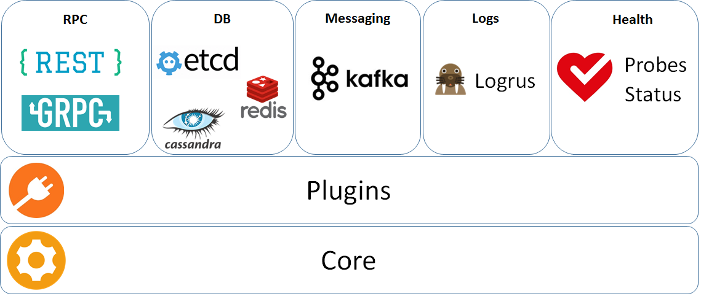

# CN Infra

[](https://travis-ci.org/ligato/cn-infra)
[](https://coveralls.io/github/ligato/cn-infra?branch=master)
[](https://goreportcard.com/report/github.com/ligato/cn-infra)
[](https://godoc.org/github.com/ligato/cn-infra)
[](https://github.com/ligato/cn-infra/blob/master/LICENSE.md)

The CN infra is a framework that can be used to build a customized management/control
plane for cloud-native Virtual Network Functions (VNFs). Cloud-native VNFs are also 
known as "CNFs".

If you are interested in contributing, please see the [contribution guidelines](CONTRIBUTING.md).

## Architecture



Brief description:
* RPC - allows to easily expose API via REST & GRPC
* DB - provides a common API and connectivity to the data store ([etcd](db/keyval/etcdv3), [Redis](db/keyval/redis), [Casssandra](db/sql/cassandra))
* Messaging - provides a common API and connectivity to message busses ([Kafka](messaging/kafka), ...)
* Logging - Integrated [Logrus](logging/logrus) for logging and a [plugin](logging/logmanager) supporting a modification of log level at runtime.
* [Health](statuscheck) - Self health check mechanism among plugins plus RPCs:
  *  probes (callable remotely from K8s)
  *  status (health check status) 
* [Core](core) - lifecycle management of plugins (loading, initialization, unloading)

## Quickstart
Following code snippet illustrates how to start your own flavour of plugins.
Whole code can be found [here](examples/simple-agent/agent.go).
```
func main() {
	flavour := Flavour{}
	agent := core.NewAgent(logroot.Logger(), 15*time.Second, flavour.Plugins()...)

	err := core.EventLoopWithInterrupt(agent, nil)
	if err != nil {
		os.Exit(1)
	}
}
```

GoDoc can be browsed [online](https://godoc.org/github.com/ligato/cn-infra).


## Contribution:

If you are interested in contributing, please see the [contribution guidelines](CONTRIBUTING.md).