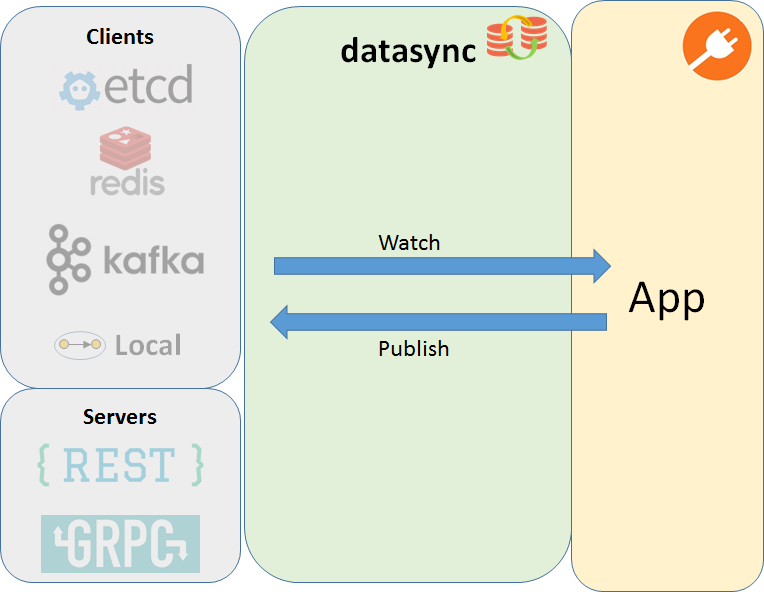

# Concept
It is usual that the logic of a microservice relies on data synchronization. In this context, 
the data synchronization is about two or more data sets that need to be synchronized when the event was published. The event can be published by database (when particular data was changed),   
by message bus (such as Kafka).

The datasync plugin helps other plugins/APP to (see next diagram):
 1. Watch data - subscribe for particular data changes to receive events 
                 with current data in channels
 2. Publish data - publish events with current values
 

 
## Watch data
The API distinguishes between:
1. Full data resync (startup, for certain fault recovery) - reprocess whole (configuration) data 
2. Optimized datasync - process only changes (deltas)

### Full data resync
Fault tolerance vs. data synchronization
In a fault-tolerant solution, there is a need to recover from faults. This plugin helps to solve the
data resynchronization (data RESYNC) aspect of fault recovery.
When the Agent loses connectivity (to etcd, Kafka, VPP etc.), it needs to recover from that fault:
1. When connectivity is reestablished after a failure, the agent can resynchronize (configuration) from a northbound 
   client with southbound configuration (VPP etc.).
2. Alternative behavior: Sometimes it is easier to use "brute force" and restart the container (both VPP and the agent) 
   and skip the resynchronization. This restart is supposed to be done by control plane & orchestration
   layer. The Agent is supposed to just publish the event.

To report a fault/error occurred and notify the datasync plugin there is defined following API call.

### Optimized mode
In optimized mode, we do not need to reprocess the whole (configuration) data but rather process just the delta
(only the changed object in current value of go channel event).
 
## Responsibility of plugins
Each plugin is responsible for its own part of (configuration) data received from northbound clients. Each plugin needs 
to be decoupled from a particular datasync transport (etcd/Redis, more will come soon: Kafka, Local, GRPC, REST ...).
Every other plugin (then datasync plugin) receives (configuration) data only through GO interfaces defined 
in [datasync_api.go](datasync_api.go)

The data of one plugin can have references to the data of another plugin. Therefore, we need 
to have proper time/order of data resynchronization between plugins. The datasync plugin
initiates full data resync in the same order as the other plugins have been registered in Init().


## Example
```go
package example
import (
    "errors"
    "context"
    "io"
    "github.com/ligato/cn-infra/datasync"
    "github.com/ligato/cn-infra/logging"
    "github.com/ligato/cn-infra/utils/safeclose"
)

type PluginXY struct {
    Watcher     datasync.Watcher //Injected
    Logger      logging.Logger
    ParentCtx   context.Context
    
    dataChange  chan datasync.ChangeEvent
    dataResync  chan datasync.ResyncEvent
    cancel      context.CancelFunc
}

func (plugin * PluginXY) Init() (err error) {    
    // initialize channels & start go routins
    plugin.dataChange = make(chan datasync.ChangeEvent, 100)
    plugin.dataResync = make(chan datasync.ResyncEvent, 100)
    
    // initiate context & cancel function (to stop go routine)
    var ctx context.Context
    if plugin.ParentCtx == nil {
        ctx, plugin.cancel = context.WithCancel(context.Background())    
    } else {
        ctx, plugin.cancel = context.WithCancel(plugin.ParentCtx)
    }   
    
    go func() {
        for {
            select {
            case dataChangeEvent := <-plugin.dataChange:
                plugin.Logger.Debug(dataChangeEvent)
            case dataResyncEvent := <-plugin.dataResync:
                plugin.Logger.Debug(dataResyncEvent)
            case <-ctx.Done():
                // stop watching for notifications
                return
            }
        }
    }()
    
    return nil
}

func (plugin * PluginXY) AfterInit() error {
    // subscribe plugin.channel for watching data (to really receive the data)
    plugin.Watcher.WatchData("watchingXY", plugin.dataChange, plugin.dataResync, "keysXY")

    return nil
}

func (plugin * PluginXY) Close() error {
    // cancel watching the channels
    plugin.cancel()
    
    // close all resources / channels
    _, err := safeclose.CloseAll(plugin.dataChange, plugin.dataResync)
    return err 
}
```


