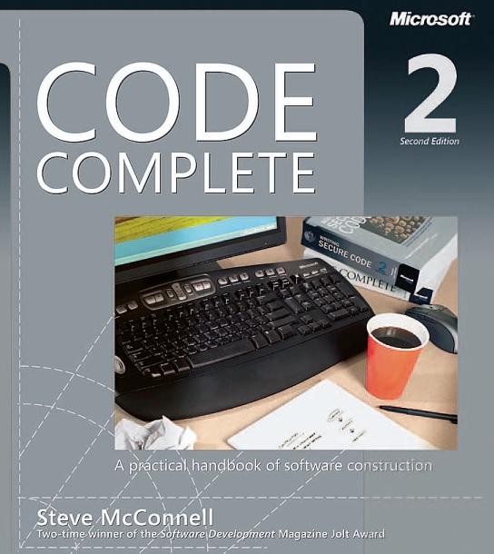

You can put documentation on three different places (README.md, doc.go, GOlang comments)

|               | Description   | Visibility                                                                   |
| ------------- |---------------|------------------------------------------------------------------------------|
| README.md     | High level information about some package with images | visible while browsing repository    |
| doc.go        | Detailed information about GO package (usually with source code snippets) | visible in godoc |
| Comments      | Function/Type documentation in GO code |                                                     |

For more information see book:

