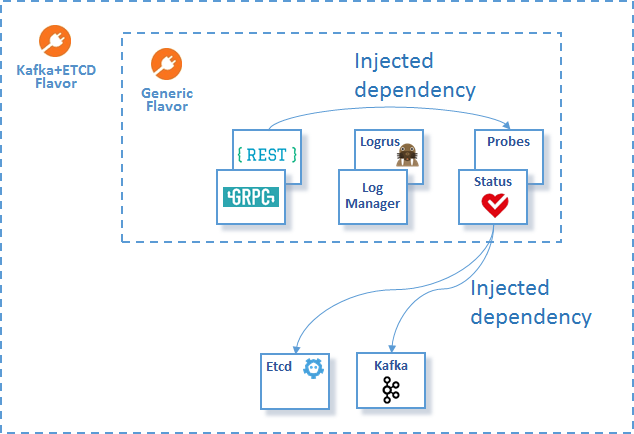

# Flavors

A [flavor](../docs/guidelines/PLUGIN_FLAVORS.md) is a reusable collection of
plugins with initialized [dependencies](../docs/guidelines/PLUGIN_DEPENDENCIES.md). 

The most importatnt CN-Infra flavors are:
* [local flavor](local) - a minimal set of plugins. It just initializes logging
  & statuschek. It is useful for embedding agent plugins into different projects
   that use their own infrasturcure.
* [RPC flavor](rpc) - a collection of plugins that exposes RPCs. It also registers
  management APIs for:
  * status check (RPCs probed from systems such as K8s)
  * logging (for changing log level at runtime remotely)
* [connectors flavor](connectors) - is combination of ETCD, Cassandra, Redis & 
  Kafka related plugins.
  
The following diagram depicts:
* plugins that are parts of a specific flavor
* the initialized (injected) [statuscheck](../health/statuscheck) dependency 
  within the [etcd client plugin](../db/keyval/etcdv3) and the 
  [Kafka client plugin](../messaging/kafka)
* the [local flavor](local) embedded in:
    * [all connectors flavor](connectors) 
    * [RPC flavor](rpc)

