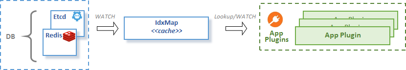
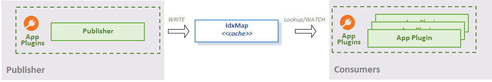

# Concept

The idxmap package provides an enhanced mapping structure to help in the following 
use cases:
* Caching the the data in key-value store (such as etcd)
* Exposing local plugin information - idxmap used for exposing one plugin's data to another plugins 

For more detailed description see the godoc.

## Caching Use Case
Imagine that you need the data from the key-value store cached (see following diagram) 
because you need to:
- either minimize lookups of the key-value store 
- or you need to lookup by secondary indexes (fields of structured values stored in key value store) 

Therefore idxmap can watch key value store, see:
- implementation of [cache helper.go](mem/cache_helper.go)
- example of [caching IP addresses of different containers](https://github.com/ligato/vpp-agent/tree/master/examples/idx_iface_cache) 

## Exposing plugin local information Use Case
App plugin needs to expose some structured information to one or multiple app plugins 
inside the agent (see following diagram).

If this structured data is stored in idxmap then, multiple plugins can read its information 
1. either via Lookup using primary keys or secondary indices;
2. or watching data changes in the map (using channels or callbacks) 
   (subscribe for changes and receive notification once an item is added or removed).

Examples:
* Real world example from [VPP-agent plugin API](https://github.com/ligato/vpp-agent/blob/master/plugins/defaultplugins/defaultplugins_api.go)
* Isolated and simplified examples can be found here: 
  * [lookup](https://github.com/ligato/vpp-agent/tree/master/examples/idx_mapping_lookup)
  * [watch](https://github.com/ligato/vpp-agent/tree/master/examples/idx_mapping_watcher)

